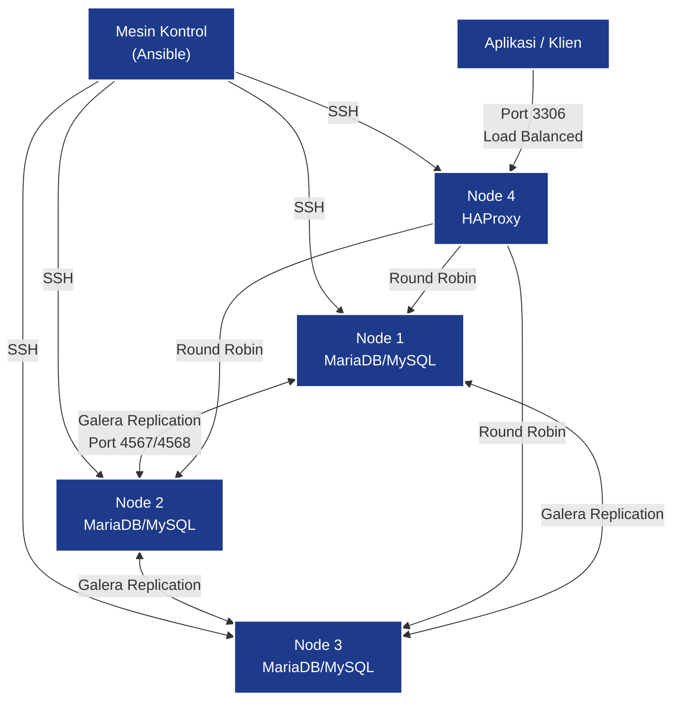

# Ansible Galera Cluster Playbook

Kumpulan playbook Ansible untuk mendeploy **MySQL/MariaDB Galera Cluster** dengan **HAProxy** sebagai load balancer.

Terdapat **2 versi playbook** yang bisa dipilih sesuai kebutuhan:

| Playbook | Database | Versi | Support | Repo |
|---|---|---|---|---|
| **mysql-5_7-galera-cluster** | MySQL | 5.7 | **EOL** (End of Life sejak 2023) | Codership (pihak ketiga) |
| **mariadb-galera-cluster** | MariaDB | 10.11 LTS | **Active** (support sampai 2028) | MariaDB Foundation (resmi) |

---

## Daftar Isi

- [Fitur Umum Galera Cluster](#fitur-umum-galera-cluster)
- [Perbandingan MySQL vs MariaDB](#perbandingan-mysql-vs-mariadb)
- [Struktur Proyek](#struktur-proyek)
- [Persyaratan Sistem](#persyaratan-sistem)
- [Cara Penggunaan](#cara-penggunaan)
  - [Opsi 1: MySQL 5.7 Galera Cluster](#opsi-1-mysql-57-galera-cluster)
  - [Opsi 2: MariaDB Galera Cluster (Rekomendasi)](#opsi-2-mariadb-galera-cluster-rekomendasi)
- [Perintah Umum](#perintah-umum)
- [Verifikasi Cluster](#verifikasi-cluster)
- [Troubleshooting](#troubleshooting)
- [Rekomendasi](#rekomendasi)

---

## Fitur Umum Galera Cluster

Kedua playbook menggunakan teknologi **Galera Cluster** yang memiliki fitur-fitur berikut:

| Fitur | Keterangan |
|---|---|
| **Multi-Master** | Baca & tulis di node mana pun, kapan pun |
| **Synchronous Replication** | Tidak ada slave lag, data tidak hilang saat node crash |
| **Tightly Coupled** | Semua node menyimpan state yang sama, tidak ada divergensi data |
| **Automatic Node Provisioning** | Node baru otomatis sinkron tanpa backup manual |
| **Hot Standby** | Tidak ada downtime saat failover |
| **Transparan ke Aplikasi** | Tidak perlu perubahan kode aplikasi |
| **No Read/Write Splitting** | Tidak perlu memisahkan koneksi baca/tulis |
| **Load Balanced** | HAProxy mendistribusikan traffic secara round-robin |
| **Health Check Otomatis** | HAProxy otomatis mendeteksi node mati/hidup |

---

## Perbandingan MySQL vs MariaDB

| Aspek | MySQL 5.7 Galera | MariaDB 10.11 Galera |
|---|---|---|
| **Status** | EOL (End of Life) | Active LTS |
| **Versi Galera** | Galera 3 | Galera 4 |
| **SST Method** | rsync (blocking) | mariabackup (non-blocking) |
| **Bootstrap** | `mysqld_bootstrap` | `galera_new_cluster` |
| **Systemd Service** | `mysql` | `mariadb` |
| **Streaming Replication** | Tidak | Ya (Galera 4) |
| **Security Patch** | Tidak ada | Aktif sampai 2028 |
| **OS Support** | Ubuntu 16.04+ | Ubuntu 20.04 / 22.04 / 24.04+ |
| **HAProxy Dashboard** | Tidak | Ya (port 8404) |
| **Auto Cleanup** | Tidak | Ya (hapus anonymous user + test DB) |

---

## Struktur Proyek

```
ansible-mysql-galera-cluster/
│
├── README.md                         ← Dokumentasi utama (ini)
│
├── mysql-5_7-galera-cluster/         ← Playbook MySQL 5.7 (LEGACY)
│   ├── README.md                     ← Dokumentasi MySQL
│   ├── inventory.yml                 ← Daftar host (mysql_cluster + load_balancer)
│   ├── deploy-mysql-cluster.yml      ← Playbook utama
│   ├── mysql-cluster-config.j2       ← Template konfigurasi Galera
│   └── haproxy-config.j2             ← Template konfigurasi HAProxy
│
└── mariadb-galera-cluster/           ← Playbook MariaDB 10.11 (RECOMMENDED)
    ├── README.md                     ← Dokumentasi lengkap MariaDB
    ├── inventory.yml                 ← Daftar host (mariadb_cluster + load_balancer)
    ├── deploy-mariadb-cluster.yml    ← Playbook utama
    ├── mariadb-cluster-config.j2     ← Template konfigurasi Galera
    └── haproxy-config.j2             ← Template konfigurasi HAProxy
```

---

## Script Persiapan Otomatis (`prepare-cluster.sh`)

Tersedia script shell interaktif untuk mempermudah setup dari awal hingga deploy.

**Lokasi:** `prepare-cluster.sh` (root folder proyek)

### Yang Dilakukan Script

| Step | Fungsi | Keterangan |
|---|---|---|
| 1 | **Deteksi OS** | Otomatis deteksi Ubuntu 20/22/24 & Debian 11/13 |
| 2 | **Cek Internet** | Test koneksi ke mirror & server key |
| 3 | **Update Sistem** | `apt update && apt upgrade` |
| 4 | **Install Dependencies** | Python3, pip, Ansible, tools pendukung |
| 5 | **Konfigurasi Firewall** | Buka port 3306, 4444, 4567, 4568 sesuai peran node |
| 6 | **Setup SSH Key** | Generate ed25519 key jika belum ada |
| 7 | **Copy SSH Key** | Copy public key ke semua server (via sshpass atau manual) |
| 8 | **Pilih Playbook** | Pilih MariaDB 10.11 (rekomendasi) atau MySQL 5.7 |
| 9 | **Input Server** | Masukkan IP, port, user untuk semua node |
| 10 | **Test Koneksi** | Verifikasi SSH ke semua server |
| 11 | **Generate Inventory** | Buat `inventory.yml` otomatis |
| 12 | **Update Variabel** | Set cluster name & root password di playbook |
| 13 | **Run Ansible** | Jalankan playbook (atau skip untuk manual nanti) |
| - | **Simpan Kredensial** | File `.credentials-*.txt` (HAPUS setelah dipakai!) |

### Cara Pakai

```bash
# Di mesin kontrol (laptop/PC tempat Ansible)
chmod +x prepare-cluster.sh
./prepare-cluster.sh
```

Script akan memandu Anda langkah demi langkah, dari install Ansible hingga deploy cluster.

### Catatan Penting

- Script ini dijalankan di **mesin kontrol** (bukan di server cluster)
- Server tujuan harus sudah bisa diakses via SSH (minimal sudah install OpenSSH)
- Password root akan di-generate otomatis jika dikosongkan
- File kredensial disimpan dengan permission `600` — tetap **hapus setelah selesai**

---

## Persyaratan Sistem

### Minimum Server

| Role | Jumlah | CPU | RAM | Disk |
|---|---|---|---|---|
| **Database Node** | 3 node | 2 core | 4 GB | 20 GB |
| **Load Balancer** | 1 node | 1 core | 2 GB | 10 GB |

### Port yang Dibutuhkan

| Port | Protocol | Fungsi |
|---|---|---|
| 3306 | TCP | Koneksi klien MySQL/MariaDB |
| 4444 | TCP | SST (State Snapshot Transfer) |
| 4567 | TCP/UDP | Replikasi Galera |
| 4568 | TCP | IST (Incremental State Transfer) |
| 22 | TCP | SSH (untuk Ansible) |

### Software di Mesin Kontrol

| Software | Minimal Versi | Cara Install |
|---|---|---|
| Ansible | 2.9+ | `brew install ansible` atau `sudo apt install ansible` |
| Python | 3.6+ | `sudo apt install python3` |
| OpenSSH | 7.0+ | (bawaan sistem) |

---

## Cara Penggunaan

### Persiapan Awal (Semua Server)

Jalankan di **setiap server** (cluster node & HAProxy):

```bash
# 1. Update sistem
sudo apt update && sudo apt upgrade -y

# 2. Install Python 3 (wajib untuk Ansible)
sudo apt install -y python3 python3-apt

# 3. Buka port firewall (khusus node database)
sudo ufw allow 3306/tcp
sudo ufw allow 4444/tcp
sudo ufw allow 4567/tcp
sudo ufw allow 4567/udp
sudo ufw allow 4568/tcp
sudo ufw allow 22/tcp
```

### Persiapan SSH (Dari Mesin Kontrol)

```bash
# 1. Generate SSH key (jika belum punya)
ssh-keygen -t ed25519

# 2. Copy key ke setiap server
ssh-copy-id user@ip-server-1
ssh-copy-id user@ip-server-2
ssh-copy-id user@ip-server-3
ssh-copy-id user@ip-server-4

# 3. Test koneksi
ssh user@ip-server-1 "hostname"
```

---

### Opsi 1: MySQL 5.7 Galera Cluster

> **Catatan:** MySQL 5.7 sudah EOL. Gunakan hanya jika terpaksa atau untuk migrasi.

```bash
cd mysql-5_7-galera-cluster/

# 1. Edit inventory
nano inventory.yml

# 2. Edit variabel (password, cluster name)
nano deploy-mysql-cluster.yml

# 3. Test koneksi Ansible
ansible all -i inventory.yml -m ping

# 4. Deploy cluster
ansible-playbook --fork=1 deploy-mysql-cluster.yml -i inventory.yml
```

**Dokumentasi lengkap:** [mysql-5_7-galera-cluster/README.md](mysql-5_7-galera-cluster/README.md)

---

### Opsi 2: MariaDB Galera Cluster (Rekomendasi)

```bash
cd mariadb-galera-cluster/

# 1. Edit inventory (isi dengan IP server Anda)
nano inventory.yml

# 2. Edit variabel
#    Buka deploy-mariadb-cluster.yml
#    Ganti mariadb_root_password dengan password kuat
nano deploy-mariadb-cluster.yml

# 3. Test koneksi Ansible
ansible all -i inventory.yml -m ping -u ubuntu

# 4. Deploy cluster
ansible-playbook --fork=1 deploy-mariadb-cluster.yml -i inventory.yml
```

> Gunakan opsi `--fork=1` untuk menonaktifkan eksekusi paralel, menjaga konsistensi data saat bootstrap cluster.

**Dokumentasi lengkap:** [mariadb-galera-cluster/README.md](mariadb-galera-cluster/README.md)

---

## Perintah Umum

### Deploy Cluster

```bash
# MySQL
ansible-playbook --fork=1 deploy-mysql-cluster.yml -i inventory.yml

# MariaDB
ansible-playbook --fork=1 deploy-mariadb-cluster.yml -i inventory.yml
```

### Stop Cluster (Safely)

```bash
# MySQL
ansible-playbook --fork=1 deploy-mysql-cluster.yml -i inventory.yml --tags "stop_cluster"

# MariaDB
ansible-playbook --fork=1 deploy-mariadb-cluster.yml -i inventory.yml --tags "stop_cluster"
```

### Start / Bootstrap Cluster

```bash
# MySQL
ansible-playbook --fork=1 deploy-mysql-cluster.yml -i inventory.yml --tags "start_cluster"

# MariaDB
ansible-playbook --fork=1 deploy-mariadb-cluster.yml -i inventory.yml --tags "start_cluster"
```

### Test Koneksi

```bash
ansible all -i inventory.yml -m ping
```

---

## Verifikasi Cluster

### Melalui Output Playbook

Setelah playbook selesai, akan tampil info cluster:

```
ok: [haproxy_load_balancer] => {
    "msg": [
        " Test connection successfull",
        " Total number of active mysql nodes in cluster: '3 '",
        " Setup Completed!"
    ]
}
```

Untuk MariaDB, informasinya lebih detail:
```
ok: [haproxy_load_balancer] => {
    "msg": [
        "=========================================",
        " MariaDB Galera Cluster Setup Complete!",
        "=========================================",
        " Cluster Name   : prod_mariadb_cluster",
        " Active Nodes   : 3",
        " Cluster State  : Synced",
        " Connection     : mysql -h 192.168.10.5 -P 3306 -u root -p",
        " HAProxy Stats  : http://192.168.10.5:8404/"
    ]
}
```

### Melalui Query

```bash
mysql -h IP_LOAD_BALANCER -P 3306 -u root -p
```

```sql
-- Cek jumlah node aktif
SHOW STATUS LIKE 'wsrep_cluster_size';

-- Cek status setiap node
SHOW STATUS LIKE 'wsrep_local_state_comment';

-- Cek koneksi
SHOW STATUS LIKE 'wsrep_connected';
```

### Melalui HAProxy Dashboard (Khusus MariaDB)

```
http://IP_LOAD_BALANCER:8404/
```

- Username: `admin`
- Password: `admin123`

---

## Troubleshooting

### Masalah: SSH Connection Refused

```bash
# Cek koneksi dasar
ping IP_SERVER
ssh user@IP_SERVER

# Pastikan SSH key sudah ter-copy
ssh-copy-id user@IP_SERVER
```

### Masalah: Node Gagal Join Cluster

```bash
# Cek status service
sudo systemctl status mariadb  # atau mysql

# Cek log error
sudo tail -100 /var/log/mysql/error.log | grep -i "galera\|wsrep\|error"

# Restart node
sudo systemctl restart mariadb
```

### Masalah: Semua Node Down (Cluster Recovery)

```bash
# 1. Cek node dengan safe_to_bootstrap = 1
sudo cat /var/lib/mysql/grastate.dat

# 2. Di node tersebut, bootstrap ulang
# Untuk MariaDB:
sudo galera_new_cluster
# Untuk MySQL:
sudo /usr/bin/mysqld_bootstrap

# 3. Start node lain
sudo systemctl start mariadb  # atau mysql
```

### Masalah: Port Bind Error

```bash
# Cek port 3306
sudo netstat -tulpn | grep 3306

# Hentikan proses yang menggunakan port
sudo systemctl stop mariadb mysql
sudo kill -9 $(lsof -ti:3306)
```

---

## Rekomendasi

### Pilih MariaDB 10.11

Sangat **direkomendasikan** untuk menggunakan **MariaDB Galera Cluster** karena:

1. **MySQL 5.7 sudah EOL** — Tidak ada patch keamanan sejak 2023
2. **MariaDB 10.11 adalah LTS** — Support aktif sampai Mei 2028
3. **Galera 4** — Fitur streaming replication, performa lebih baik
4. **mariabackup** — SST non-blocking, tidak mengunci tabel
5. **Repo resmi** — Dari MariaDB Foundation, bukan pihak ketiga
6. **Keamanan** — Masih mendapat update keamanan reguler

### Arsitektur Deployment



---

## Lisensi

Proyek ini bersifat open source. Silakan gunakan, modifikasi, dan distribusikan sesuai kebutuhan.

---

## Kontribusi

Jika ingin berkontribusi:

1. Fork repository ini
2. Buat branch fitur (`git checkout -b fitur-keren`)
3. Commit perubahan (`git commit -m 'Tambah fitur keren'`)
4. Push ke branch (`git push origin fitur-keren`)
5. Buat Pull Request