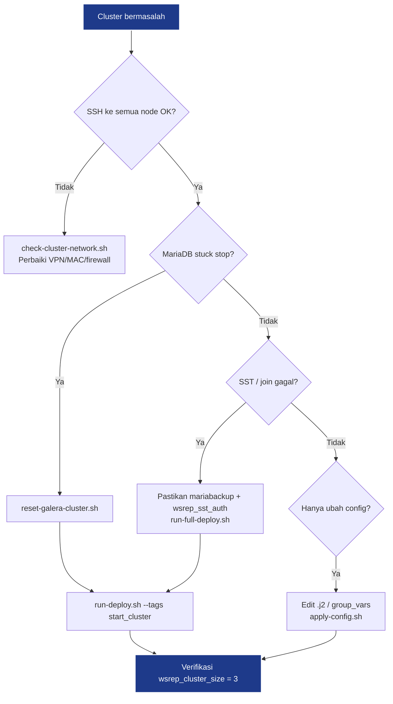

# Panduan Operasi — MariaDB Galera Cluster + HAProxy

Dokumen ini merangkum alur deploy, penanganan error, dan cara menerapkan
konfigurasi MariaDB **permanen** berdasarkan perbaikan yang sudah dilakukan
di lingkungan Proxmox (MacBook → SSH → 3 node DB + HAProxy).

---

## Daftar Isi

1. [Alur Operasional](#1-alur-operasional)
2. [Deploy & Verifikasi](#2-deploy--verifikasi)
3. [Menambah / Mengubah Config Permanen](#3-menambah--mengubah-config-permanen)
4. [Troubleshooting & Perbaikan Error](#4-troubleshooting--perbaikan-error)
5. [Perintah Cepat](#5-perintah-cepat)
6. [Keamanan & Catatan](#6-keamanan--catatan)

---

## 1. Alur Operasional

### 1.1 Mesin Administrator (MacBook)

Semua perintah dijalankan dari folder ini:

```bash
cd mariadb-galera-cluster-fix
```

### 1.2 Setup Sekali

| Langkah | Perintah | Keterangan |
|---------|----------|------------|
| Install Ansible | `brew install ansible` | Mac |
| Collection MySQL | `ansible-galaxy collection install -r requirements.yml` | Wajib |
| SSH key | `./setup-ssh.sh` | Opsional jika sudah passwordless |
| Inventory IP | `./configure-inventory.sh` | Atur IP node 1–3 + HAProxy |
| Sudo password | `cp group_vars/all/secrets.yml.example group_vars/all/secrets.yml` | Password **sudo Linux** user `vta` |
| HAProxy stats | Edit `group_vars_haproxy.yml` | User/password dashboard `:8404` |

> **Penting:** `secrets.yml` = password **sudo Linux**, BUKAN password MariaDB.
> Password MariaDB ada di `deploy-mariadb-cluster.yml` (`mariadb_root_password`).

### 1.3 Script Utama

| Script | Fungsi |
|--------|--------|
| `./run-deploy.sh` | Pre-flight SSH/sudo + deploy playbook |
| `./run-full-deploy.sh` | Reset cluster paksa + deploy penuh |
| `./reset-galera-cluster.sh` | Stop SIGKILL, wipe slave, set `safe_to_bootstrap` |
| `./apply-config.sh` | Deploy config template + rolling restart |
| `./check-cluster-network.sh` | Cek SSH, ping antar-node, MAC duplikat |
| `./fix-sudo-on-server.sh` | Jalankan **di server sebagai root** → NOPASSWD sudo |

---

## 2. Deploy & Verifikasi

### 2.1 Deploy Normal

```bash
./run-deploy.sh
```

Setara dengan:

```bash
ansible-playbook --fork=1 deploy-mariadb-cluster.yml -e @group_vars_haproxy.yml
```

Tag playbook:

| Tag | Fungsi |
|-----|--------|
| `stop_cluster` | Stop paksa semua node |
| `start_cluster` | Bootstrap primary + join slave |

Contoh hanya start cluster:

```bash
ansible-playbook --fork=1 deploy-mariadb-cluster.yml \
  -e @group_vars_haproxy.yml --tags start_cluster
```

### 2.2 Deploy Ulang dari Nol (cluster rusak)

```bash
./run-full-deploy.sh
```

### 2.3 Verifikasi Cluster

```bash
# Via HAProxy (disarankan)
mysql -h <IP_HAPROXY> -u root -p -e "
  SHOW STATUS LIKE 'wsrep_cluster_size';
  SHOW STATUS LIKE 'wsrep_cluster_status';
  SHOW STATUS LIKE 'wsrep_local_state_comment';
  SHOW VARIABLES LIKE 'max_allowed_packet';
"
```

Harusnya:

| Variable | Nilai OK |
|----------|----------|
| `wsrep_cluster_size` | `3` |
| `wsrep_cluster_status` | `Primary` |
| `wsrep_local_state_comment` | `Synced` |

```bash
# Per node langsung
ansible mariadb_cluster -m shell --become -a \
  "mysql -uroot -p<PASSWORD> -e \"SHOW STATUS LIKE 'wsrep_cluster_size';\""

# HAProxy stats (semua backend UP)
curl -u admin:<STATS_PASS> http://<IP_HAPROXY>:8404/
```

---

## 3. Menambah / Mengubah Config Permanen

Config MariaDB/Galera dikelola lewat **template Ansible .j2**, bukan edit manual
di server (supaya konsisten di 3 node).

### 3.1 File yang Perlu Diedit

| File | Isi |
|------|-----|
| `mariadb-cluster-config.j2` | Semua setting `[mysqld]` Galera + tuning |
| `group_vars/all/mariadb.yml` | Variabel tuning (disarankan, mudah diubah) |
| `haproxy-config.j2` | Config HAProxy (jika perlu) |

### 3.2 Contoh: Ubah `max_allowed_packet`

**Cara A — lewat group_vars (disarankan):**

Edit `group_vars/all/mariadb.yml`:

```yaml
mariadb_max_allowed_packet: "512M"
```

Pastikan baris di template memakai variabel:

```ini
max_allowed_packet={{ mariadb_max_allowed_packet | default('512M') }}
```

**Cara B — langsung di template:**

Edit `mariadb-cluster-config.j2`, tambah/ubah baris di section `[mysqld]`.

### 3.3 Terapkan ke Semua Node (Permanen)

Config **baru aktif setelah restart** MariaDB. Wajib rolling restart
(satu node per waktu) agar cluster tetap quorum.

```bash
./apply-config.sh
```

Script ini:
1. Deploy `/etc/mysql/conf.d/mariadb_galera_cluster.cnf` ke semua node
2. Restart MariaDB **serial: 1** (node 2 → 3 → 1)
3. Verifikasi `wsrep_cluster_size` per node

**Manual (jika perlu):**

```bash
# Deploy template — WAJIB sertakan variabel Galera
ansible mariadb_cluster -m template --become \
  -a "src=mariadb-cluster-config.j2 dest=/etc/mysql/conf.d/mariadb_galera_cluster.cnf owner=mysql group=mysql mode=0640" \
  -e "mariadb_cluster_name=prod_mariadb_cluster mariadb_sst_password=<SST_PASS>"

# Rolling restart — JANGAN pakai --serial (hanya ada di playbook)
for node in mariadb_node_2 mariadb_node_3 mariadb_node_1; do
  ansible "$node" -m systemd -a "name=mariadb state=restarted" --become
  sleep 15
done
```

Atau pakai `-f 1` (forks=1, bukan serial):

```bash
ansible mariadb_cluster -m systemd -a "name=mariadb state=restarted" --become -f 1
```

### 3.4 Cek Config Sudah Ter-apply

```bash
# Di server
grep max_allowed /etc/mysql/conf.d/mariadb_galera_cluster.cnf

# Di MySQL (setelah restart)
mysql -h <IP_HAPROXY> -u root -p -e "SHOW VARIABLES LIKE 'max_allowed_packet';"
# 512M = 536870912 bytes
```

### 3.5 Variabel Tuning yang Tersedia

File: `group_vars/all/mariadb.yml`

| Variabel | Default | Keterangan |
|----------|---------|------------|
| `mariadb_cluster_name` | `prod_mariadb_cluster` | Nama cluster Galera |
| `mariadb_max_allowed_packet` | `512M` | Ukuran packet max |
| `mariadb_key_buffer_size` | `256M` | MyISAM buffer |
| `mariadb_innodb_buffer_pool_size` | `1G` | InnoDB cache |
| `mariadb_max_connections` | `500` | Koneksi simultan |

> **Galera:** nilai tuning harus **identik di semua node**.

---

## 4. Troubleshooting & Perbaikan Error

### 4.1 Inventory / Ansible

| Gejala | Penyebab | Solusi |
|--------|----------|--------|
| Inventory tidak ter-parse | Format INI dengan ekstensi `.yml` | Pakai `inventory.yml` format YAML + `ansible.cfg` |
| `module community.mysql not found` | Collection belum terinstall | `ansible-galaxy collection install -r requirements.yml` |
| Missing sudo password | User `vta` butuh password sudo | Isi `group_vars/all/secrets.yml` ATAU jalankan `fix-sudo-on-server.sh` di server |
| `prepare-cluster.sh` gagal di Mac | Butuh `/etc/os-release` Linux | Pakai flow Mac: `configure-inventory.sh` + `run-deploy.sh` |

### 4.2 Jaringan & SSH

| Gejala | Penyebab | Solusi |
|--------|----------|--------|
| Node 2 unreachable / intermittent | **MAC address duplikat** di Proxmox (node 1 & 2 sama) | Regenerate MAC di Proxmox → `./check-cluster-network.sh` |
| SSH timeout | VPN putus / firewall | Cek koneksi: `ansible all -m ping` |

**Cek MAC duplikat:**

```bash
./check-cluster-network.sh
```

### 4.3 MariaDB Stuck / Stop Gagal

| Gejala | Penyebab | Solusi |
|--------|----------|--------|
| Stuck di `deactivating` / stop hang | Galera SST hang | `./reset-galera-cluster.sh` (SIGKILL + wipe slave) |
| `systemctl stop` tidak cukup | Proses mariadbd/wsrep_sst masih hidup | Playbook sudah pakai force kill; atau reset script |

```bash
./reset-galera-cluster.sh
./run-deploy.sh --tags start_cluster
```

### 4.4 Bootstrap & Galera State

| Gejala | Penyebab | Solusi |
|--------|----------|--------|
| Bootstrap gagal | `safe_to_bootstrap: 0` | `./reset-galera-cluster.sh` set `safe_to_bootstrap: 1` di primary |
| `wsrep_cluster_size` kosong / 1 | Cluster belum form / node belum join | Cek log: `journalctl -u mariadb -n 100 --no-pager` |

Set manual di primary (darurat):

```bash
ansible mariadb_node_1 -m shell --become -a \
  "sed -i 's/safe_to_bootstrap:.*/safe_to_bootstrap: 1/' /var/lib/mysql/grastate.dat"
```

### 4.5 SST / mariabackup Gagal

| Gejala | Penyebab | Solusi |
|--------|----------|--------|
| `No donor candidates temporarily available` | User `mariabackup` belum ada saat slave join | Playbook sudah buat user **sebelum** slave start |
| `Access denied for user 'mariabackup'` | `wsrep_sst_auth` hilang/salah | Pastikan ada di config: `wsrep_sst_auth="mariabackup:{{ password }}"` |
| Slave `activating` terus | SST gagal | Cek `/var/log/mysql/error.log` di donor & joiner |

Buat user mariabackup manual di primary (darurat):

```bash
ansible mariadb_node_1 -m community.mysql.mysql_user --become \
  -a 'name=mariabackup host=localhost password=<SST_PASS> priv="*.*:RELOAD,PROCESS,LOCK TABLES,REPLICATION CLIENT" state=present login_user=root login_password=<ROOT_PASS> login_host=127.0.0.1'
```

### 4.6 bind-address / Port 3306

| Gejala | Penyebab | Solusi |
|--------|----------|--------|
| Timeout port 3306 | `50-server.cnf` bind `127.0.0.1` | Playbook override ke `0.0.0.0` + config template `bind-address=0.0.0.0` |
| HAProxy backend DOWN | MariaDB tidak listen di IP eksternal | `ss -tln \| grep 3306` harus `0.0.0.0:3306` |

### 4.7 Password Root / Playbook Exit 2

| Gejala | Penyebab | Solusi |
|--------|----------|--------|
| `Access denied root@localhost (using password: NO)` | Root sudah punya password, unix_socket gagal | Playbook sudah punya task fallback password auth |
| Playbook exit 2 tapi cluster jalan | 1 task gagal non-kritis | Cek `wsrep_cluster_size`; cluster OK = abaikan atau re-run task user |

### 4.8 Config Tidak Berubah Setelah Edit Template

| Gejala | Penyebab | Solusi |
|--------|----------|--------|
| `max_allowed_packet` masih 16M | Config belum di-deploy / belum restart | `./apply-config.sh` |
| `ansible -m template` gagal | Variabel `mariadb_cluster_name` undefined | Pakai `./apply-config.sh` atau sertakan `-e` variabel Galera |

### 4.9 `--serial` di Ad-Hoc Ansible

| Gejala | Penyebab | Solusi |
|--------|----------|--------|
| `unrecognized arguments: --serial` | `--serial` hanya ada di `ansible-playbook` | Pakai `-f 1` atau loop per node, atau `./apply-config.sh` |

### 4.10 Diagram Alur Recovery



---

## 5. Perintah Cepat

```bash
# Ping semua host
ansible all -m ping

# Status MariaDB semua node
ansible mariadb_cluster -m shell --become -a "systemctl is-active mariadb"

# Cluster size semua node
ansible mariadb_cluster -m shell --become -a \
  'mysql -uroot -p<PASS> -N -e "SHOW STATUS LIKE '"'"'wsrep_cluster_size'"'"';"'

# Log error MariaDB (node 1)
ansible mariadb_node_1 -m shell --become -a "tail -50 /var/log/mysql/error.log"

# Restart HAProxy
ansible haproxy_load_balancer -m systemd -a "name=haproxy state=restarted" --become

# Deploy config permanen + rolling restart
./apply-config.sh

# Reset total + deploy
./run-full-deploy.sh
```

---

## 6. Keamanan & Catatan

- Jangan commit `group_vars/all/secrets.yml`, `group_vars_haproxy.yml`, `.pass` ke git.
- Port Galera wajib terbuka antar-node DB: **3306, 4444, 4567, 4568**.
- Aplikasi connect ke **HAProxy** (`:3306`), bukan langsung ke node Galera.
- File arsip lama ada di folder `trash/` (STEP.md, prepare-cluster.sh).
- Bug fix dari versi asli: lihat `CHANGELOG.md`.

---

## Port & Firewall

| Port | Protokol | Fungsi |
|------|----------|--------|
| 3306 | TCP | Client / HAProxy → MariaDB |
| 4567 | TCP+UDP | Galera replication (gcomm) |
| 4568 | TCP | IST |
| 4444 | TCP | SST (mariabackup) |
| 8404 | HTTP | HAProxy stats dashboard |
