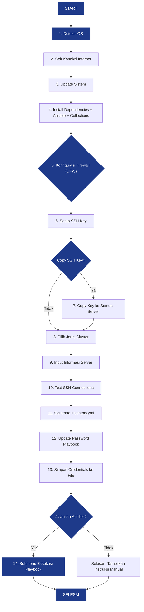
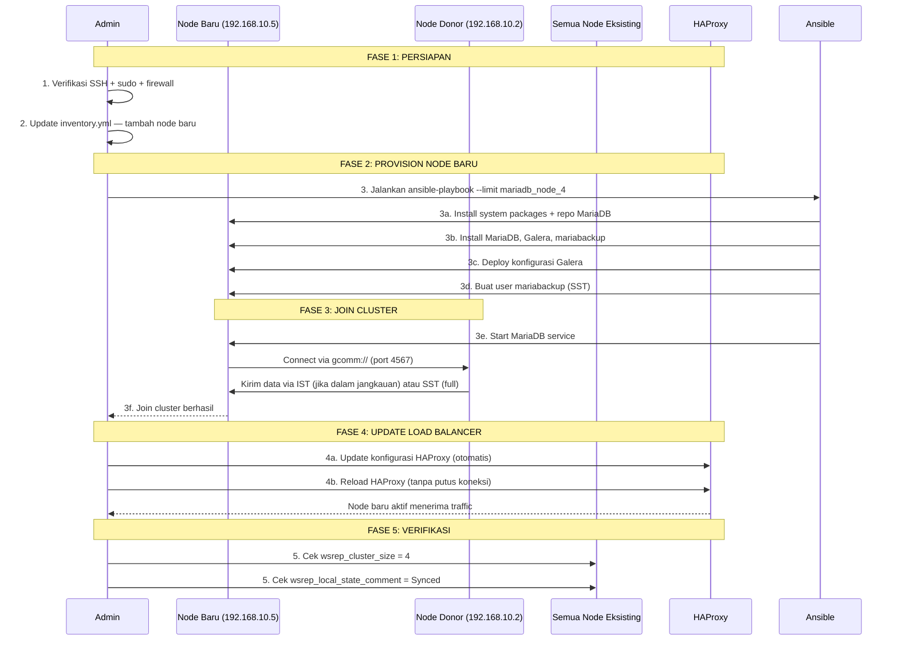

# 📘 Dokumentasi Lengkap — MariaDB Galera Cluster + HAProxy (Versi Diperbaiki)

## Daftar Isi

1. [Pendahuluan & Arsitektur](#1-pendahuluan--arsitektur)
2. [Persyaratan Sistem](#2-persyaratan-sistem)
3. [Struktur Direktori & File](#3-struktur-direktori--file)
4. [Instalasi & Setup Awal](#4-instalasi--setup-awal)
   - [4.1 Setup SSH Key (Opsi A)](#41-setup-ssh-key-menggunakan-setup-sshsh)
   - [4.2 Persiapan Manual (Opsi B)](#42-persiapan-manual-tanpa-setup-sshsh)
5. [Menjalankan Script Utama](#5-menjalankan-script-utama-prepare-clustersh)
6. [Menjalankan Ansible Playbook](#6-menjalankan-ansible-playbook)
7. [Verifikasi Cluster](#7-verifikasi-cluster)
8. [Penggunaan Sehari-hari](#8-penggunaan-sehari-hari)
   - [8.1 Koneksi ke Database](#81-koneksi-ke-database)
   - [8.2 Monitoring via HAProxy Stats](#82-monitoring-via-haproxy-stats)
   - [8.3 Manajemen Cluster](#83-manajemen-cluster)
   - [8.4 Perintah Dasar MySQL/MariaDB](#84-perintah-dasar-mysqlmariadb)
9. [Menambahkan Node Database Baru](#9-menambahkan-node-database-baru)
10. [Menghapus Node Database](#10-menghapus-node-database)
11. [Mengganti Password](#11-mengganti-password)
12. [Backup & Restore](#12-backup--restore)
13. [Pemecahan Masalah (Troubleshooting)](#13-pemecahan-masalah-troubleshooting)
14. [Keamanan](#14-keamanan)
15. [Referensi Perintah Cepat](#15-referensi-perintah-cepat-cheat-sheet)

---

## 1. Pendahuluan & Arsitektur

### 1.1 Apa Itu MariaDB Galera Cluster?

MariaDB Galera Cluster adalah solusi **database clustering multi-master** yang memungkinkan:
- **Multi-master replication**: Setiap node bisa menerima read/write
- **Synchronous replication**: Data identik di semua node dalam cluster
- **Auto-join**: Node baru otomatis bergabung dan melakukan sync data
- **No data loss**: Jika satu node mati, node lain tetap melayani traffic tanpa kehilangan data
- **Transparent failover**: Aplikasi tidak perlu tahu node mana yang aktif

### 1.2 Arsitektur Sistem

```
                          ┌─────────────────────┐
                          │   Client Applications  │
                          │  (App, Web, API, dll)  │
                          └──────────┬──────────┘
                                     │
                                     │ Port 3306
                                     ▼
                     ┌─────────────────────────────────┐
                     │    HAProxy Load Balancer          │
                     │   Mode: TCP (Layer 4)             │
                     │   Algorithm: roundrobin           │
                     │   Health Check: tcp-check         │
                     │   Stats Dashboard: http://IP:8404 │
                     └──────┬──────────┬──────────┘
                            │          │
              ┌─────────────┼──────────┼─────────────┐
              │             │          │              │
              ▼             ▼          ▼              │
      ┌────────────┐ ┌────────────┐ ┌────────────┐   │
      │ MariaDB    │◄═══════════►│ MariaDB    │◄══╗   │
      │ Node 1     │════════════►│ Node 2     │   ║   │
      │ 10.0.0.2   │◄═══════════┤ 10.0.0.3   │   ║   │
      └────────────┘ └────────────┘ └────────────┘   ║   │
              │                                        ║   │
              └────────────────────────────────────────╝   ▼
                                                   ┌────────────┐
                                                   │ MariaDB    │
                                                   │ Node 4     │
                                                   │ (baru)     │
                                                   └────────────┘
```

### 1.3 Komponen Utama

| Komponen | Versi | Fungsi |
|----------|-------|--------|
| **MariaDB** | 10.11 | Database server dengan Galera patch |
| **Galera** | 4.x (galera-4) | Library replikasi multi-master synchronous |
| **mariabackup** | 10.11 | Tools untuk backup hot + State Snapshot Transfer (SST) |
| **HAProxy** | 2.x | Load balancer TCP untuk mendistribusikan koneksi |
| **Ansible** | >= 2.15 | Automation/configuration management tool |

### 1.4 Port yang Dibutuhkan Antar Node

| Port | Protocol | Fungsi |
|------|----------|--------|
| 22 | TCP | SSH untuk manajemen dan Ansible |
| 3306 | TCP | Koneksi client / HAProxy ke database |
| 4444 | TCP | SST (State Snapshot Transfer) — full sync via mariabackup |
| 4567 | TCP+UDP | Replikasi Galera (gcomm) — komunikasi antar node cluster |
| 4568 | TCP | IST (Incremental State Transfer) — sync perubahan saja |
| 8404 | TCP | HAProxy Stats Dashboard (web interface monitoring) |

---

## 2. Persyaratan Sistem

### 2.1 Spesifikasi Minimum

| Komponen | Minimum | Rekomendasi |
|----------|---------|-------------|
| **CPU** | 2 core | 4+ core per node |
| **RAM** | 4 GB | 8+ GB per node |
| **Disk** | 20 GB | SSD, 50+ GB (tergantung ukuran database) |
| **Network** | 1 Gbps | 10 Gbps antar node (replikasi sensitif terhadap latency) |
| **Jumlah Node DB** | 3 | 3-7 node (semakin banyak, semakin besar overhead replikasi) |
| **Load Balancer** | 1 | 2 (untuk high availability, dengan keepalived/VRRP) |

### 2.2 Sistem Operasi Didukung

| OS | Versi Didukung | Kode Nama |
|----|----------------|-----------|
| **Ubuntu** | 20.04, 22.04, 24.04 | Focal, Jammy, Noble |
| **Debian** | 11, 12, 13 | Bullseye, Bookworm, Trixie |

### 2.3 Prasyarat Mesin Ansible (Tempat menjalankan script)

- **Python** 3.8+
- **Ansible Core** >= 2.15 (akan diinstall otomatis oleh script)
- **Ansible Collections**:
  - `community.mysql >= 3.6.0` — modul `mysql_user` / `mysql_db`
  - `community.general >= 8.0.0` — dependency pendukung
- **SSH client** (`openssh-client`)
- **openssl** (untuk auto-generate password)
- **Koneksi internet** untuk download packages

### 2.4 Prasyarat Server Tujuan (Semua Node)

- [x] **SSH akses passwordless** dari mesin Ansible ke semua server
- [x] **sudo tanpa password** (`ubuntu ALL=(ALL) NOPASSWD:ALL` di `/etc/sudoers`)
- [x] **Firewall port terbuka**: 22 (SSH), 3306, 4444, 4567/tcp+udp, 4568
- [x] **Hostname unik** setiap server, tidak ada konflik. Cek: `hostname`
- [x] **Waktu sinkron** (NTP). Cek: `timedatectl`
- [x] **`/etc/hosts`** berisi resolusi nama semua node cluster (opsional tapi disarankan)
- [x] **AppArmor/SELinux** dalam mode permissive atau disabled (playbook akan disable otomatis)
- [x] **Disk tersedia** cukup untuk menyimpan full copy database (SST)

### 2.5 Contoh Topologi Jaringan (3 DB + 1 LB)

| Hostname | IP Address | Peran | Spesifikasi |
|----------|------------|-------|-------------|
| `mariadb_node_1` | 192.168.10.2 | Database Node 1 | 4 CPU, 8GB RAM, 50GB SSD |
| `mariadb_node_2` | 192.168.10.3 | Database Node 2 | 4 CPU, 8GB RAM, 50GB SSD |
| `mariadb_node_3` | 192.168.10.4 | Database Node 3 | 4 CPU, 8GB RAM, 50GB SSD |
| `haproxy_lb` | 192.168.10.5 | Load Balancer HAProxy | 2 CPU, 4GB RAM, 20GB SSD |

---

## 3. Struktur Direktori & File

```
mariadb-galera-cluster-fix/
│
├── prepare-cluster.sh          # Script utama interaktif (orchestrator) — 890 baris
├── setup-ssh.sh                # Script setup SSH key (opsional) — 392 baris
├── deploy-mariadb-cluster.yml  # Ansible playbook utama (43 tasks) — 496 baris
├── inventory.yml               # File inventory (contoh, akan ditimpa script)
├── requirements.yml            # Daftar Ansible collection wajib
├── mariadb-cluster-config.j2   # Template Jinja2 konfigurasi MariaDB Galera
├── haproxy-config.j2           # Template Jinja2 konfigurasi HAProxy
├── README.md                   # Dokumentasi ringkas
├── CHANGELOG.md                # Daftar 27 perbaikan dari versi asli
├── STEP.md                     # Dokumentasi lengkap ini
└── group_vars_haproxy.yml      # Variabel HAProxy stats (di-generate script)
```

### Fungsi Masing-Masing File

| File | Peran | Wajib? |
|------|-------|--------|
| `prepare-cluster.sh` | Script interaktif: deteksi OS, install Ansible, generate inventory, update password, deploy | Ya |
| `setup-ssh.sh` | Generate & copy SSH key ke semua server | Opsional (sangat disarankan) |
| `deploy-mariadb-cluster.yml` | Ansible playbook: install MariaDB, Galera, HAProxy, konfigurasi, user | Ya |
| `inventory.yml` | Daftar server: grup `mariadb_cluster` dan `load_balancer` | Ya (harus sesuai) |
| `requirements.yml` | Ansible collection dependencies (community.mysql, community.general) | Ya — untuk auto-install |
| `mariadb-cluster-config.j2` | Template `/etc/mysql/conf.d/mariadb_galera_cluster.cnf` | Ya |
| `haproxy-config.j2` | Template `/etc/haproxy/haproxy.cfg` | Ya |
| `group_vars_haproxy.yml` | Password HAProxy stats (di-generate script prepare-cluster.sh) | Di-generate otomatis |
| `.credentials-*.txt` | File berisi semua password (HAPUS setelah dicatat!) | Di-generate otomatis |

---

## 4. Instalasi & Setup Awal

Ada dua cara untuk memulai. Pilih salah satu:

### 4.1 Setup SSH Key (Menggunakan `setup-ssh.sh`)

**Cara ini disarankan** jika Anda belum punya SSH key yang terpasang di semua server.

```bash
# 1. Masuk ke direktori
cd /path/to/mariadb-galera-cluster-fix

# 2. Beri izin eksekusi
chmod +x setup-ssh.sh prepare-cluster.sh

# 3. Jalankan setup SSH
./setup-ssh.sh
```

**Alur interaktif `setup-ssh.sh`:**

```
 Step 1: Cek Prasyarat
         → Otomatis install openssh-client dan sshpass jika belum ada

 Step 2: Setup SSH Key Lokal
         → Generate key ed25519 jika belum ada di ~/.ssh/id_ed25519
         → Tampilkan public key

 Step 3: Pilih Cara Input Server
   a) Input manual satu per satu (interaktif)
   b) Baca dari file daftar (format: ip,port,user per baris)

 Step 4: Copy SSH Key ke Semua Server
   Pilih metode autentikasi:
   a) Password SAMA untuk semua server (lebih cepat)
   b) Password BERBEDA per server (akan ditanya satu-satu)
   c) Sudah pakai key lain / passwordless (langsung copy tanpa password)

 Step 5: Tes Koneksi Tanpa Password
         → Verifikasi semua server bisa diakses passwordless
         → Tampilkan ringkasan: IP + STATUS (OK/FAILED)
```

**Contoh input manual:**
```
Server ke-1:
  IP Address        : 192.168.10.2
  SSH Port [22]     : 22
  SSH User [ubuntu] : ubuntu

Server ke-2:
  IP Address        : 192.168.10.3
  ...

Ketik 'selesai' untuk berhenti.
```

**Contoh file daftar server** (simpan sebagai `servers.txt`):
```text
192.168.10.2,22,ubuntu
192.168.10.3,22,ubuntu
192.168.10.4,22,ubuntu
192.168.10.5,22,ubuntu
```

### 4.2 Persiapan Manual (Tanpa `setup-ssh.sh`)

Jika SSH key sudah siap atau ingin manual:

```bash
# 1. Generate SSH key (jika belum punya)
ssh-keygen -t ed25519 -f ~/.ssh/id_ed25519 -N ""

# 2. Copy ke setiap server satu per satu
ssh-copy-id -o StrictHostKeyChecking=accept-new ubuntu@192.168.10.2
ssh-copy-id -o StrictHostKeyChecking=accept-new ubuntu@192.168.10.3
ssh-copy-id -o StrictHostKeyChecking=accept-new ubuntu@192.168.10.4
ssh-copy-id -o StrictHostKeyChecking=accept-new ubuntu@192.168.10.5

# 3. Verifikasi passwordless
ssh ubuntu@192.168.10.2 hostname
ssh ubuntu@192.168.10.3 hostname
ssh ubuntu@192.168.10.4 hostname
ssh ubuntu@192.168.10.5 hostname
# Semua harus balik dengan hostname masing-masing tanpa minta password
```

---

## 5. Menjalankan Script Utama `prepare-cluster.sh`

### 5.1 Eksekusi

```bash
cd /path/to/mariadb-galera-cluster-fix
chmod +x prepare-cluster.sh
./prepare-cluster.sh
```

### 5.2 Alur Interaktif (14 Langkah)



### 5.3 Detail Tiap Langkah

#### Langkah 1-4: Otomatis (Tidak Ada Input)

Script akan mengeksekusi secara otomatis:

**1 - Deteksi OS:**
- Mendeteksi apakah Ubuntu 20.04/22.04/24.04 atau Debian 11/12/13
- Jika OS tidak didukung, script berhenti

**2 - Cek Koneksi Internet:**
- Ping ke `1.1.1.1`, `mirror.mariadb.org`, `archive.ubuntu.com`
- Jika 0 target reachable, tanya user apakah tetap lanjut

**3 - Update Sistem:**
- `sudo apt-get update && sudo apt-get upgrade`

**4 - Install Dependencies:**
- Python 3, pip, `python3-pymysql`, `software-properties-common`, `curl`, `wget`, `gnupg`, `ufw`, `net-tools`, `lsof`
- Ansible Core >= 2.15 (via pip dulu, fallback ke apt)
- **Ansible Collections WAJIB**: `community.mysql >= 3.6.0` dan `community.general >= 8.0.0`
- `sshpass` (untuk copy SSH key otomatis)

#### Langkah 5: Firewall — Input Penting

```
Apakah server INI adalah node DATABASE cluster?
  a) Ya - buka port database & Galera (3306, 4444, 4567, 4568)
  b) Tidak - hanya buka port SSH (mis. load balancer)
Pilihan (a/b) [b]:
```

> **⚠️ PENTING:**
> - Jalankan script ini di **setiap server** untuk konfigurasi firewall masing-masing
> - Port Galera (4444, 4567, 4568) **WAJIB** dibuka untuk node database — tidak opsional
> - Jika menjalankan dari satu mesin saja, atur firewall server lain secara manual

#### Langkah 6-7: SSH Key

Script akan:
1. Generate key ed25519 jika belum ada (`~/.ssh/id_ed25519`)
2. Tampilkan public key
3. Tanya: `Apakah Anda ingin men-copy SSH key ke server lain sekarang? (y/N)`

#### Langkah 8: Pilih Jenis Cluster

```
Pilih jenis database yang akan di-deploy:
  a) MariaDB 10.11 Galera Cluster (RECOMMENDED - support sampai 2028)
```

> Hanya MariaDB yang tersedia (opsi MySQL 5.7 Galera yang sudah EOL dihapus). Pilih `a`.

#### Langkah 9: Input Informasi Server

Script akan meminta input secara interaktif untuk:

**Minimal 3 node database:**

```
--- Node Database ke-1 ---
  IP Address        : 192.168.10.2
  SSH Port [22]     : 22
  SSH User [ubuntu] : ubuntu
  Hostname label    : mariadb_node_1

--- Node Database ke-2 ---
  IP Address        : 192.168.10.3
  SSH Port [22]     : 22
  SSH User [ubuntu] : ubuntu
  Hostname label    : mariadb_node_2

--- Node Database ke-3 ---
  IP Address        : 192.168.10.4
  SSH Port [22]     : 22
  SSH User [ubuntu] : ubuntu
  Hostname label    : mariadb_node_3
```

**1 node load balancer:**

```
--- Node Load Balancer (HAProxy) ---
  IP Address        : 192.168.10.5
  SSH Port [22]     : 22
  SSH User [ubuntu] : ubuntu
```

**Kredensial:**

```
--- Kredensial Database ---
  Nama Cluster [galera_cluster]: prod_cluster
  Root Password (kosongkan untuk generate otomatis):
```

**Password auto-generate:**

| Kredensial | Cara Generate | Contoh |
|------------|---------------|--------|
| **Root Password** | Jika dikosongkan: `openssl rand` alfanumerik 20 karakter | `aB3xK9mP2qR7vW8nL5jS` |
| **SST (mariabackup) Password** | Auto-generate alfanumerik 20 karakter | `xK9mP2qR7vW8nL5jSaB3` |
| **HAProxy Stats Password** | Auto-generate alfanumerik 16 karakter | `mP2qR7vW8nL5jSaB` |

> **⚠️ PENTING: Catat SEMUA password ini!** Akan disimpan di file `.credentials-*.txt`, tapi file itu harus dihapus setelah dicatat.

#### Langkah 10: Test SSH

Script akan test koneksi SSH ke semua server yang dimasukkan. Jika ada yang gagal:
- Tampilkan pesan error
- Tanya: `Tetap lanjutkan? (y/N)` — jika N, script berhenti

#### Langkah 11: Generate Inventory

File `inventory.yml` akan dibuat otomatis dengan format:

```yaml
# Inventory generated by prepare-cluster.sh
# interface_ip ditambahkan eksplisit agar Galera/HAProxy tidak
# salah pilih interface pada server multi-NIC.

[mariadb_cluster]
mariadb_node_1 ansible_host=192.168.10.2 ansible_port=22 ansible_user=ubuntu interface_ip=192.168.10.2
mariadb_node_2 ansible_host=192.168.10.3 ansible_port=22 ansible_user=ubuntu interface_ip=192.168.10.3
mariadb_node_3 ansible_host=192.168.10.4 ansible_port=22 ansible_user=ubuntu interface_ip=192.168.10.4

[load_balancer]
haproxy_load_balancer ansible_host=192.168.10.5 ansible_port=22 ansible_user=ubuntu interface_ip=192.168.10.5
```

**Penjelasan variabel per host:**
| Variabel | Fungsi |
|----------|--------|
| `ansible_host` | IP untuk koneksi SSH dari mesin Ansible |
| `ansible_port` | Port SSH |
| `ansible_user` | User SSH |
| `interface_ip` | IP yang dipakai untuk bind Galera/HAProxy (penting untuk server multi-NIC) |

#### Langkah 12: Update Password di Playbook

Script menggunakan **Python** (bukan `sed`!) untuk mengganti password di `deploy-mariadb-cluster.yml`. Ini aman terhadap karakter spesial seperti `& / \ # $ '` yang bisa merusak perintah `sed`.

Teknik yang dipakai:
- **YAML single-quote escaping**: string password dibungkus dengan `'...'` dan apostrof di-escape jadi `''`
- **Regex replacement via lambda**: mencegah backslash di password diinterpretasikan sebagai escape sequence Python

#### Langkah 13: Simpan Credentials

File `.credentials-YYYYMMDDHHMMSS.txt` dibuat dengan permission `600`. Isi file:

```text
=========================================
 MariaDB Galera Cluster Credentials
 Generated: Fri Jun 26 14:00:00 WIB 2026
=========================================

 Cluster Type        : mariadb
 Cluster Name        : prod_cluster
 Root Password       : aB3xK9mP2qR7vW8nL5jS
 SST/mariabackup Pwd : xK9mP2qR7vW8nL5jSaB3
 HAProxy Stats Pwd   : mP2qR7vW8nL5jSaB

 Node Database:
   - mariadb_node_1 (192.168.10.2)
   - mariadb_node_2 (192.168.10.3)
   - mariadb_node_3 (192.168.10.4)

 Load Balancer HAProxy:
   IP: 192.168.10.5:3306
   Stats: http://192.168.10.5:8404/

=========================================
 PENTING: Pindahkan password ini ke vault/secret
 manager, lalu HAPUS file ini setelah dicatat!
=========================================
```

#### Langkah 14: Tanya Eksekusi Ansible

```
Apakah Anda ingin menjalankan Ansible playbook sekarang?
Jalankan Ansible? (y/N):
```

Jika pilih `y`, muncul submenu (lihat Section 6).

---

## 6. Menjalankan Ansible Playbook

### 6.1 Submenu Eksekusi (dari `prepare-cluster.sh`)

```
Pilih aksi:
  a) Deploy cluster BARU (full)
  b) START cluster saja (bootstrap)
  c) STOP cluster saja
  d) Test koneksi Ansible saja (ping)
  e) BATAL / jangan jalankan sekarang
Pilihan (a/b/c/d/e) [a]:
```

| Opsi | Kegunaan | Kapan Dipakai |
|------|----------|---------------|
| **a** | **Deploy FULL** — instalasi pertama. Hapus data lama, install ulang semua | Instalasi pertama kali |
| **b** | **Start/bootstrap** — cluster sudah pernah diinstal tapi dimatikan | Setelah stop cluster |
| **c** | **Stop cluster** — matikan semua service MariaDB dengan urutan yang benar | Maintenance/shutdown |
| **d** | **Ping test** — verifikasi Ansible bisa konek ke semua host | Troubleshooting |
| **e** | **Batal** — hanya generate file, tidak execute. Tampilkan perintah manual | Jika ingin deploy nanti |

### 6.2 Cara Manual (Tanpa Script)

```bash
cd /path/to/mariadb-galera-cluster-fix

# Deploy full cluster (instalasi pertama)
ansible-playbook --fork=1 deploy-mariadb-cluster.yml \
  -i inventory.yml \
  -e @group_vars_haproxy.yml

# Start cluster saja (jika sudah pernah diinstal)
ansible-playbook --fork=1 deploy-mariadb-cluster.yml \
  -i inventory.yml \
  -e @group_vars_haproxy.yml \
  --tags start_cluster

# Stop cluster saja
ansible-playbook --fork=1 deploy-mariadb-cluster.yml \
  -i inventory.yml \
  -e @group_vars_haproxy.yml \
  --tags stop_cluster

# Test koneksi Ansible ke semua host
ansible all -i inventory.yml -m ping
```

### 6.3 Penjelasan Parameter Ansible

| Parameter | Fungsi |
|-----------|--------|
| `--fork=1` | Eksekusi 1 host dalam satu waktu. **WAJIB** untuk Galera karena urutan start/stop penting |
| `-i inventory.yml` | Menentukan file inventory yang berisi daftar server |
| `-e @group_vars_haproxy.yml` | Extra vars — memasukkan variabel dari file (password HAProxy stats) |
| `--tags start_cluster` | Hanya menjalankan task yang memiliki tag `start_cluster` |
| `--tags stop_cluster` | Hanya menjalankan task yang memiliki tag `stop_cluster` |
| `--limit hostname` | Membatasi eksekusi hanya ke host tertentu (berguna untuk menambah node) |
| `--step` | Konfirmasi setiap task sebelum dijalankan (debugging) |
| `--check` | Dry-run / mode simulasi — tidak benar-benar menjalankan perubahan |

### 6.4 Yang Dilakukan Playbook (43 Tasks)

Playbook `deploy-mariadb-cluster.yml` terdiri dari **9 section**:

```mermaid
sequenceDiagram
    participant Ansible as Ansible Playbook
    participant Node1 as Node 1 (Primary)
    participant Node2 as Node 2 (Slave)
    participant Node3 as Node 3 (Slave)
    participant LB as HAProxy

    Note over Ansible,LB: SECTION 1: SETUP REPOSITORY
    
    Ansible->>+Node1: Install system packages (gnupg, curl, ca-certificates)
    Ansible->>Node1: Download MariaDB GPG key (get_url)
    Ansible->>Node1: Convert key ke format dearmored
    Ansible->>Node1: Add MariaDB repository (signed-by keyring)
    Ansible->>-Node1: Pin repository priority 1001
    Ansible->>+Node2: (sama)
    Ansible->>-Node2: (sama)
    Ansible->>+Node3: (sama)
    Ansible->>-Node3: (sama)

    Note over Ansible,LB: SECTION 2: INSTALL PACKAGES
    
    Ansible->>Node1: Disable AppArmor profile MariaDB
    Ansible->>Node1: Install mariadb-server, galera-4, mariadb-backup, rsync
    Ansible->>Node1: Stop & mask service (cegah auto-start sebelum siap)
    Ansible->>Node2: (sama)
    Ansible->>Node3: (sama)

    Note over Ansible,LB: SECTION 3: KONFIGURASI
    
    Ansible->>Node1: Deploy mariadb-cluster-config.j2 ke /etc/mysql/conf.d/
    Ansible->>Node1: Hapus konfigurasi default yang konflik
    Ansible->>Node2: (sama)
    Ansible->>Node3: (sama)

    Note over Ansible,LB: SECTION 4: STOP CLUSTER (tag: stop_cluster)
    
    Ansible->>Node1: Unmask service
    Ansible->>Node2: Stop MariaDB (slave)
    Ansible->>Node3: Stop MariaDB (slave)
    Ansible->>Node1: Stop MariaDB (primary - terakhir)

    Note over Ansible,LB: SECTION 5: START / BOOTSTRAP (tag: start_cluster)
    
    Ansible->>Node1: Bootstrap: galera_new_cluster (primary)
    Ansible->>Node1: Wait_for port 3306 (timeout 90s)
    Ansible->>Node1: Enable MariaDB systemd
    Ansible->>Node2: Start MariaDB (slave, retry 5x)
    Ansible->>Node2: Wait_for port 3306 (timeout 300s untuk SST)
    Ansible->>Node3: Start MariaDB (slave, retry 5x)
    Ansible->>Node3: Wait_for port 3306 (timeout 300s)

    Note over Ansible,LB: SECTION 6: SETUP HAPROXY
    
    Ansible->>LB: Install HAProxy + python3-pymysql
    Ansible->>LB: Enable HAProxy systemd
    Ansible->>LB: Deploy haproxy-config.j2 (validasi: haproxy -c -f %s)

    Note over Ansible,LB: SECTION 7: SETUP USERS & PASSWORD
    
    Ansible->>Node1: Set root password (via unix_socket)
    Ansible->>Node1: Hapus anonymous user + database test
    Ansible->>Node1: Buat user mariabackup@localhost (SST)
    Ansible->>Node1: Buat user haproxy (health-check)
    Ansible->>Node2: Buat user mariabackup@localhost (SST)
    Ansible->>Node3: Buat user mariabackup@localhost (SST)

    Note over Ansible,LB: SECTION 8: RESTART HAPROXY
    
    Ansible->>LB: Restart HAProxy dengan konfig baru

    Note over Ansible,LB: SECTION 9: VERIFIKASI
    
    Ansible->>LB: Cek wsrep_cluster_size (via HAProxy)
    Ansible->>LB: Cek wsrep_local_state_comment
    Ansible->>LB: Tampilkan info koneksi cluster
```

### 6.5 Detail Playbook per Section

| Section | Baris | Isi | Untuk Node |
|---------|-------|-----|------------|
| **1. Setup Repo** | 39-118 | Install system packages, download GPG key via `get_url` (bukan `apt_key` deprecated), dearmor key, add apt repo dengan `signed-by`, pin priority | DB |
| **2. Install Packages** | 120-183 | Disable AppArmor, install `mariadb-server`, `galera-4`, `mariadb-backup`, `rsync`, `python3-pymysql`, stop & mask systemd | DB |
| **3. Konfigurasi** | 185-217 | Deploy template `mariadb-cluster-config.j2`, hapus config lama (`mysql.cnf`, `mysql_galera_cluster.cnf`) | DB |
| **4. Stop Cluster** | 219-260 | Unmask service, stop slave dulu (delay 15s), stop primary (delay 10s) — **tag: stop_cluster** | DB |
| **5. Start/Bootstrap** | 262-328 | Bootstrap primary via `galera_new_cluster`, `wait_for` port 3306 (90s), enable systemd, start slave dengan **retries 5**, `wait_for` port 3306 (300s untuk SST) — **tag: start_cluster** | DB |
| **6. Setup HAProxy** | 330-358 | Install `haproxy`, enable systemd, deploy template `haproxy-config.j2` dengan validasi `haproxy -c -f %s` | LB |
| **7. Setup Users** | 360-434 | Set root password via **unix_socket** (andal untuk run pertama & selanjutnya), hapus anonymous user + db test, buat user `mariabackup@localhost` di **semua node** (bukan hanya primary), buat user `haproxy` untuk health-check | DB |
| **8. Restart HAProxy** | 436-445 | systemctl restart + daemon-reload | LB |
| **9. Verifikasi** | 447-496 | Cek `wsrep_cluster_size` dan `wsrep_local_state_comment` via LB, tampilkan info koneksi | LB |

### 6.6 Perbaikan Kritis di Playbook (Dari Versi Asli)

| # | Perbaikan | Dampak Jika Tidak Diperbaiki |
|---|-----------|------------------------------|
| 1 | `apt_key` module (deprecated) → `get_url` + `signed-by` keyring | Instalasi repo gagal di Ubuntu 22.04/24.04 |
| 2 | `wsrep_sst_auth` ditambahkan di config | SST/IST antar-node **SELALU** gagal autentikasi — node baru tidak bisa join |
| 3 | `login_unix_socket` untuk root, bukan `login_password: ""` | Gagal autentikasi pada run kedua setelah password sudah diset |
| 4 | `wait_for` port 3306, bukan `pause` statis | SST besar >10s menyebabkan task setelahnya gagal connect |
| 5 | `interface_ip` variabel, bukan `ansible_default_ipv4` | Salah pilih interface di server multi-NIC (umum di cloud VPS) |
| 6 | User `mariabackup` dibuat di **semua** node (bukan hanya node pertama) | Donor lain selain node pertama tidak punya user mariabackup |
| 7 | `any_errors_fatal: true` untuk task kritikal | Jika bootstrap gagal, playbook lanjut diam-diam tanpa error |
| 8 | `ignore_errors` dihapus dari task kritikal | Kegagalan tidak terdeteksi (fail fast) |

---

## 7. Verifikasi Cluster

### 7.1 Output Otomatis Playbook

Di akhir eksekusi, playbook akan menampilkan:

```
TASK [Tampilkan informasi koneksi cluster] ************************************
ok: [haproxy_load_balancer] => {
    "msg": [
        "===========================================",
        " MariaDB Galera Cluster Setup Complete!",
        "===========================================",
        " Cluster Name      : prod_mariadb_cluster",
        " Active Nodes      : 3",
        " Cluster State     : Synced",
        "",
        " Connection String :",
        " mysql -h 192.168.10.5 -P 3306 -u root -p",
        "",
        " HAProxy Stats     :",
        " http://192.168.10.5:8404/",
        "==========================================="
    ]
}
```

### 7.2 Cek Manual via Command Line

```bash
# Cek jumlah node aktif (harus 3)
mysql -h 192.168.10.5 -u root -p -N -e "SHOW STATUS LIKE 'wsrep_cluster_size'"
# Output: wsrep_cluster_size	3

# Cek status cluster (Synced = normal)
mysql -h 192.168.10.5 -u root -p -e "SHOW STATUS LIKE 'wsrep_local_state_comment'"
# Output: Synced

# Cek alamat semua node yang terdaftar
mysql -h 192.168.10.5 -u root -p -e "SHOW STATUS LIKE 'wsrep_incoming_addresses'"

# Cek apakah node siap menerima query
mysql -h 192.168.10.5 -u root -p -e "SHOW STATUS LIKE 'wsrep_ready'"
# Output: ON

# Cek konektivitas cluster
mysql -h 192.168.10.5 -u root -p -e "SHOW STATUS LIKE 'wsrep_connected'"
# Output: ON

# Informasi lengkap Galera (30 baris pertama)
mysql -h 192.168.10.5 -u root -p -e "SHOW STATUS LIKE 'wsrep_%'" | head -30
```

### 7.3 Cek Via HAProxy Stats Dashboard

**Buka browser:** `http://192.168.10.5:8404/`

**Login:**
- Username: `admin` (default)
- Password: lihat di `group_vars_haproxy.yml` atau file `.credentials-*.txt`

**Informasi di dashboard:**
| Kolom | Arti |
|-------|------|
| **Status** | UP = node hidup dan merespon health check |
| **LastChk** | Hasil health check terakhir (L4OK = TCP OK, L4TO = timeout) |
| **Weight** | Bobot traffic (semakin besar, semakin banyak koneksi) |
| **Sessions** | Jumlah koneksi aktif per node |
| **Bytes In/Out** | Total traffic masuk/keluar per node |
| **Session Rate** | Laju koneksi per detik |

### 7.4 Cek Langsung di Node Database

```bash
# SSH ke node 1
ssh ubuntu@192.168.10.2

# Cek apakah node melihat node lain
mysql -u root -p -e "SHOW GLOBAL STATUS LIKE 'wsrep_%'" | grep -E "cluster_size|cluster_status|local_state"

# Cek log MariaDB untuk error
sudo journalctl -u mariadb --no-pager | grep -i error | tail -20

# Cek port yang sedang listening
sudo ss -tlnp | grep -E "3306|4567|4568|4444"
```

---

## 8. Penggunaan Sehari-hari

### 8.1 Koneksi ke Database

Aplikasi Anda cukup konek ke **IP load balancer**, bukan ke node individual:

```bash
# Dari aplikasi / command line
mysql -h 192.168.10.5 -P 3306 -u root -p

# Connection string untuk aplikasi
# MySQL/JDBC: jdbc:mysql://192.168.10.5:3306/nama_database
# PHP PDO:    mysql:host=192.168.10.5;port=3306;dbname=nama_database
# Python:     mysql.connector.connect(host="192.168.10.5", port=3306, ...)
# Node.js:    mysql.createConnection({host: '192.168.10.5', port: 3306, ...})
```

HAProxy akan mendistribusikan koneksi secara **round-robin** ke semua node MariaDB yang aktif.

### 8.2 Monitoring via HAProxy Stats

Dashboard HAProxy tersedia di: `http://192.168.10.5:8404/`

**Fungsi dashboard:**
- Melihat status UP/DOWN setiap node database
- Melihat jumlah koneksi aktif per node
- Melihat total traffic (bytes in/out)
- **Enable/disable server** untuk maintenance (klik tombol biru di kolom Actions)
- Set weight per server

**Contoh penggunaan maintenance mode:**
1. Buka `http://192.168.10.5:8404/`
2. Klik tombol biru di baris server `mariadb_node_2`
3. Status berubah jadi `MAINT` (maintenance)
4. Node 2 tidak menerima koneksi baru, koneksi existing tetap jalan
5. Lakukan maintenance di Node 2
6. Klik tombol hijau untuk mengaktifkan kembali

### 8.3 Manajemen Cluster

**Stop cluster (urutan yang benar):**
```bash
# Slave dulu, primary terakhir
ansible-playbook deploy-mariadb-cluster.yml \
  -i inventory.yml \
  -e @group_vars_haproxy.yml \
  --tags stop_cluster
```

**Start cluster (bootstrap):**
```bash
# Primary dulu (galera_new_cluster), baru slave
ansible-playbook deploy-mariadb-cluster.yml \
  -i inventory.yml \
  -e @group_vars_haproxy.yml \
  --tags start_cluster
```

**Cek status Galera:**
```sql
-- Dari MySQL client
SHOW STATUS LIKE 'wsrep_cluster_size';     -- Jumlah node
SHOW STATUS LIKE 'wsrep_cluster_status';   -- Primary / Non-Primary
SHOW STATUS LIKE 'wsrep_local_state_comment'; -- Synced / Donor / Joiner
SHOW STATUS LIKE 'wsrep_connected';        -- ON/OFF
SHOW STATUS LIKE 'wsrep_ready';            -- ON/OFF
SHOW STATUS LIKE 'wsrep_incoming_addresses'; -- Daftar IP semua node
SHOW STATUS LIKE 'wsrep_replicated';       -- Jumlah byte yang direplikasi
SHOW STATUS LIKE 'wsrep_received';         -- Jumlah byte yang diterima
```

### 8.4 Perintah Dasar MySQL/MariaDB

```sql
-- Buat database
CREATE DATABASE IF NOT EXISTS nama_database
  CHARACTER SET utf8mb4
  COLLATE utf8mb4_unicode_ci;

-- Buat user aplikasi
CREATE USER IF NOT EXISTS 'nama_user'@'%'
  IDENTIFIED BY 'password_aman';
GRANT ALL PRIVILEGES ON nama_database.* TO 'nama_user'@'%';
FLUSH PRIVILEGES;

-- Buat user dengan akses terbatas (read-only)
CREATE USER IF NOT EXISTS 'readonly_user'@'%'
  IDENTIFIED BY 'password_aman';
GRANT SELECT ON nama_database.* TO 'readonly_user'@'%';

-- Melihat proses yang berjalan
SHOW FULL PROCESSLIST;

-- Melihat ukuran database
SELECT table_schema AS "Database",
       ROUND(SUM(data_length + index_length) / 1024 / 1024, 2) AS "Size (MB)"
FROM information_schema.TABLES
GROUP BY table_schema
ORDER BY SUM(data_length + index_length) DESC;

-- Melihat ukuran tabel
SELECT table_schema, table_name,
       ROUND(((data_length + index_length) / 1024 / 1024), 2) AS "Size (MB)"
FROM information_schema.TABLES
WHERE table_schema NOT IN ('information_schema', 'performance_schema', 'mysql')
ORDER BY (data_length + index_length) DESC
LIMIT 20;

-- Cek user dan hak akses
SELECT user, host, password_last_changed FROM mysql.user;
SHOW GRANTS FOR 'nama_user'@'%';

-- Optimasi tabel
OPTIMIZE TABLE nama_database.nama_tabel;
```

---

## 9. Menambahkan Node Database Baru

### 9.1 Konsep

Galera cluster mendukung penambahan node secara **online** tanpa downtime. Prosesnya:



### 9.2 Prasyarat Node Baru

Sebelum memulai, pastikan server baru memenuhi semua persyaratan:

**Checklist:**

- [ ] **OS terinstall** — Ubuntu 22.04/24.04 atau Debian 12
- [ ] **SSH akses passwordless** dari mesin Ansible:

    ```bash
    ssh -o StrictHostKeyChecking=accept-new ubuntu@192.168.10.5 hostname
    # Harus balik hostname tanpa minta password
    ```

- [ ] **sudo tanpa password** — cek:

    ```bash
    ssh ubuntu@192.168.10.5 "sudo -n true && echo OK || echo FAIL"
    # Output: OK
    ```

- [ ] **Firewall port terbuka** — 22, 3306, 4444, 4567/tcp+udp, 4568
- [ ] **Hostname unik** — tidak sama dengan node lain
- [ ] **Waktu sinkron** (NTP)
- [ ] **Disk cukup** — lebih besar dari ukuran database yang akan di-sync

### 9.3 Langkah Detail

#### Step 1: Verifikasi Koneksi SSH

```bash
# Test koneksi ke node baru
ssh -o StrictHostKeyChecking=accept-new ubuntu@192.168.10.5 "hostname && uptime"

# Test sudo
ssh ubuntu@192.168.10.5 "sudo -n true && echo 'Sudo OK' || echo 'Sudo FAIL'"

# Pastikan hostname unik
ssh ubuntu@192.168.10.5 "hostname"
# Harus berbeda dengan: ssh ubuntu@192.168.10.2 "hostname"
```

#### Step 2: Update Inventory

Edit file `inventory.yml` — tambahkan node baru di grup `mariadb_cluster`:

```yaml
[mariadb_cluster]
mariadb_node_1 ansible_host=192.168.10.2 ansible_port=22 ansible_user=ubuntu interface_ip=192.168.10.2
mariadb_node_2 ansible_host=192.168.10.3 ansible_port=22 ansible_user=ubuntu interface_ip=192.168.10.3
mariadb_node_3 ansible_host=192.168.10.4 ansible_port=22 ansible_user=ubuntu interface_ip=192.168.10.4
mariadb_node_4 ansible_host=192.168.10.5 ansible_port=22 ansible_user=ubuntu interface_ip=192.168.10.5   # <-- TAMBAHKAN INI

[load_balancer]
haproxy_load_balancer ansible_host=192.168.10.6 ansible_port=22 ansible_user=ubuntu interface_ip=192.168.10.6
```

#### Step 3: Provision Node Baru

Jalankan Ansible playbook dengan **`--limit`** hanya ke node baru:

```bash
cd /path/to/mariadb-galera-cluster-fix

ansible-playbook deploy-mariadb-cluster.yml \
  -i inventory.yml \
  --limit mariadb_node_4 \
  -e "@group_vars_haproxy.yml" \
  -e "mariadb_root_password='ISI_PASSWORD_ROOT_ANDA'" \
  -e "mariadb_sst_password='ISI_PASSWORD_SST_ANDA'"
```

**Penjelasan `--limit`:**

| Task | Akan jalan? | Alasan |
|------|-------------|--------|
| Section 1-3 (install repo, paket, config) | ✅ Ya | Hanya di node baru (`--limit`) |
| Section 4 (stop cluster) | ❌ Tidak | Tag `stop_cluster` tidak dipanggil |
| Section 5 (start slave) | ✅ Ya | Kondisi `inventory_hostname != groups['mariadb_cluster'][0]` = True |
| Section 5 (bootstrap primary) | ❌ Tidak | Kondisi `inventory_hostname == groups['mariadb_cluster'][0]` = False |
| Section 6 (install HAProxy) | ❌ Tidak | `--limit` hanya node baru, bukan LB |
| Section 7 (setup user) | ✅ Ya | Di semua node grup `mariadb_cluster` |

#### Step 4: Pantau Proses SST

Saat node baru join, cluster akan mentransfer data. Proses ini bisa memakan waktu.

**Pantau dari node baru:**
```bash
# Terminal 1: Pantau log MariaDB di node baru
ssh ubuntu@192.168.10.5 "sudo journalctl -u mariadb -f"

# Output yang diharapkan:
# WSREP: Shifting CLOSED -> OPEN (to: 0)
# WSREP: New COMPONENT: primary = yes
# WSREP: Establishing SST connection
# WSREP: Shifting JOINED -> SYNCED
```

**Pantau dari donor (salah satu node yang sudah ada):**
```bash
# Terminal 2: Pantau log di node donor
ssh ubuntu@192.168.10.2 "sudo tail -f /var/log/mysql/error.log | grep -i sst"

# Output yang diharapkan:
# [Note] WSREP: Member 1 synced with group.
# [Note] WSREP: Shifting DONOR/DESYNCED -> JOINED
```

**Jika SST timeout (default 300 detik):**

```bash
# Naikkan timeout di playbook
# Edit deploy-mariadb-cluster.yml baris ~323:
#   timeout: 300  →  timeout: 900  (15 menit)
```

#### Step 5: Update HAProxy

HAProxy otomatis membaca node dari `groups['mariadb_cluster']` di template. Cukup reload:

```bash
# Reload HAProxy (tidak putus koneksi yang sedang aktif)
ansible haproxy_load_balancer -i inventory.yml \
  -m shell -a "haproxy -f /etc/haproxy/haproxy.cfg -p /run/haproxy.pid -sf \$(cat /run/haproxy.pid)"
```

Atau restart (akan putus koneksi aktif):

```bash
ansible haproxy_load_balancer -i inventory.yml \
  -m systemd -a "name=haproxy state=restarted"
```

#### Step 6: Verifikasi

```bash
# 1. Cek cluster size (harus 4)
mysql -h 192.168.10.6 -u root -p -N -e "SHOW STATUS LIKE 'wsrep_cluster_size'"
# Output: 4

# 2. Cek semua alamat node
mysql -h 192.168.10.6 -u root -p -e "SHOW STATUS LIKE 'wsrep_incoming_addresses'"

# 3. Cek status node baru (harus Synced)
mysql -h 192.168.10.5 -u root -p -e "SHOW STATUS LIKE 'wsrep_local_state_comment'"
# Output: Synced

# 4. Cek via HAProxy Stats
# Buka http://192.168.10.6:8404/
# Login: admin / password dari group_vars_haproxy.yml
# Harus ada 4 server MariaDB semua UP
```

### 9.4 Copy-Paste Command untuk Tambah Node

```bash
# ==========================================
# COMMAND COPY-PASTE: TAMBAH NODE BARU
# ==========================================
# Ganti nilai berikut sesuai lingkungan Anda:
NODE_LABEL="mariadb_node_4"
NODE_IP="192.168.10.5"
ROOT_PASS="ISI_PASSWORD_ROOT"
SST_PASS="ISI_PASSWORD_SST"

# 1. (Manual) Edit inventory.yml — tambahkan baris:
#    ${NODE_LABEL} ansible_host=${NODE_IP} ansible_port=22 ansible_user=ubuntu interface_ip=${NODE_IP}

# 2. Provision node baru
ansible-playbook deploy-mariadb-cluster.yml \
  -i inventory.yml \
  --limit ${NODE_LABEL} \
  -e "@group_vars_haproxy.yml" \
  -e "mariadb_root_password='${ROOT_PASS}'" \
  -e "mariadb_sst_password='${SST_PASS}'"
  ```

  ```bash
# 3. Reload HAProxy
ansible haproxy_load_balancer -i inventory.yml \
  -m shell -a "haproxy -f /etc/haproxy/haproxy.cfg -p /run/haproxy.pid -sf \$(cat /run/haproxy.pid)"

# 4. Verifikasi
mysql -h haproxy_load_balancer -u root -p -e "SHOW STATUS LIKE 'wsrep_cluster_size'"
```

---

## 10. Menghapus Node Database

### 10.1 Hapus Node dari Cluster (Tanpa Downtime)

```bash
# 1. SSH ke node yang akan dihapus
ssh ubuntu@192.168.10.5

# 2. Set weight ke 0 (tidak terima koneksi baru)
mysql -u root -p -e "SET GLOBAL wsrep_provider_options='pc.weight=0';"

# 3. Hentikan MariaDB service
sudo systemctl stop mariadb

# 4. Keluar dari SSH
exit

# 5. Hapus node dari inventory.yml
# Hapus baris: mariadb_node_4 ...

# 6. Reload HAProxy (update backend list)
ansible haproxy_load_balancer -i inventory.yml \
  -m shell -a "haproxy -f /etc/haproxy/haproxy.cfg -p /run/haproxy.pid -sf \$(cat /run/haproxy.pid)"

# 7. Verifikasi cluster size berkurang
mysql -h <IP_LB> -u root -p -N -e "SHOW STATUS LIKE 'wsrep_cluster_size'"
# Harus: 3
```

### 10.2 Hapus Node Permanen (Bersihkan Data)

```bash
# Setelah langkah 1-6 di atas, jalankan:
ssh ubuntu@192.168.10.5 "
  sudo systemctl stop mariadb
  sudo rm -rf /var/lib/mysql/*
  sudo rm -f /etc/mysql/conf.d/mariadb_galera_cluster.cnf
  sudo apt-get remove -y mariadb-server galera-4 mariadb-backup
  sudo apt-get autoremove -y
"
```

---

## 11. Mengganti Password

### 11.1 Ganti Root Password

```bash
# 1. Login sebagai root di salah satu node
mysql -u root -p

# 2. Ganti password untuk semua host
ALTER USER 'root'@'localhost' IDENTIFIED BY 'new_password_aman';
ALTER USER 'root'@'127.0.0.1' IDENTIFIED BY 'new_password_aman';
ALTER USER 'root'@'%' IDENTIFIED BY 'new_password_aman';
FLUSH PRIVILEGES;

# 3. Update deploy-mariadb-cluster.yml
#    Edit variabel: mariadb_root_password: 'new_password_aman'
```

### 11.2 Ganti SST Password (mariabackup)

```bash
# 1. Ganti password user mariabackup di SEMUA node
for node in 192.168.10.2 192.168.10.3 192.168.10.4; do
  ssh ubuntu@$node "mysql -u root -p'old_password' -e \
    \"ALTER USER 'mariabackup'@'localhost' IDENTIFIED BY 'new_sst_password';\""
done

# 2. Update wsrep_sst_auth di SEMUA node (konfigurasi Galera)
for node in 192.168.10.2 192.168.10.3 192.168.10.4; do
  ssh ubuntu@$node "sudo sed -i \
    's/wsrep_sst_auth=.*/wsrep_sst_auth=\"mariabackup:new_sst_password\"/' \
    /etc/mysql/conf.d/mariadb_galera_cluster.cnf"
done

# 3. Rolling restart (satu per satu, tunggu sync)
for node in 192.168.10.2 192.168.10.3 192.168.10.4; do
  ssh ubuntu@$node "sudo systemctl restart mariadb"
  echo "Menunggu node $node sync..."
  sleep 30
  ssh ubuntu@$node "mysql -u root -p'new_sst_password' -e \
    \"SHOW STATUS LIKE 'wsrep_local_state_comment'\" | grep Synced || echo 'Belum sync'"
done

# 4. Update deploy-mariadb-cluster.yml
#    Edit variabel: mariadb_sst_password: 'new_sst_password'
```

### 11.3 Ganti HAProxy Stats Password

```bash
# 1. Edit group_vars_haproxy.yml
#    Ubah: haproxy_stats_password: "new_password"

# 2. Reload HAProxy (tanpa putus koneksi)
ansible haproxy_load_balancer -i inventory.yml \
  -m shell -a "haproxy -f /etc/haproxy/haproxy.cfg -p /run/haproxy.pid -sf \$(cat /run/haproxy.pid)"
```

---

## 12. Backup & Restore

### 12.1 Backup Semua Database (mysqldump)

**Metode 1: Backup dari load balancer (direkomendasikan)**
```bash
# Backup via HAProxy (koneksi didistribusikan ke node)
mysqldump -h 192.168.10.5 -u root -p \
  --all-databases \
  --single-transaction \
  --routines \
  --triggers \
  --events \
  --flush-logs \
  --master-data=2 \
  | gzip > backup-$(date +%Y%m%d-%H%M%S).sql.gz
```

**Metode 2: Backup dari node tertentu**
```bash
# Backup langsung dari node tertentu (lebih cepat, tidak lewat LB)
mysqldump -h 192.168.10.2 -u root -p \
  --all-databases \
  --single-transaction \
  --routines \
  --triggers \
  --events \
  | pigz -p 4 > backup-$(date +%Y%m%d-%H%M%S).sql.gz
# pigz = parallel gzip, install: sudo apt install pigz
```

### 12.2 Backup dengan Mariabackup (Hot Backup — Tanpa Downtime)

**Mariabackup** sudah terinstall oleh playbook. Ini metode backup yang lebih cepat dan tidak mengunci tabel.

```bash
# 1. Buat direktori backup
sudo mkdir -p /backup
sudo chown -R $(whoami) /backup

# 2. Backup full
mariabackup --backup \
  --user=root \
  --password='password_anda' \
  --target-dir=/backup/$(date +%Y%m%d) \
  2>&1 | tee /backup/backup-$(date +%Y%m%d).log

# 3. Prepare backup (agar konsisten untuk restore)
mariabackup --prepare \
  --target-dir=/backup/$(date +%Y%m%d) \
  2>&1 | tee -a /backup/backup-$(date +%Y%m%d).log

# 4. Compress
tar -czf backup-full-$(date +%Y%m%d).tar.gz -C /backup $(date +%Y%m%d)
```

### 12.3 Backup Inkremental (Mariabackup)

```bash
# 1. Backup full dulu (hanya sekali)
mariabackup --backup \
  --user=root --password='password' \
  --target-dir=/backup/full

mariabackup --prepare \
  --target-dir=/backup/full

# 2. Backup inkremental (setiap hari)
mariabackup --backup \
  --user=root --password='password' \
  --target-dir=/backup/inc1 \
  --incremental-basedir=/backup/full

# 3. Prepare dengan inkremental
mariabackup --prepare \
  --target-dir=/backup/full \
  --incremental-dir=/backup/inc1
```

### 12.4 Restore dari Backup

```bash
# 1. Hentikan MariaDB di node yang akan di-restore
sudo systemctl stop mariadb

# 2. Backup data lama (jika ada)
sudo mv /var/lib/mysql /var/lib/mysql.bak

# 3. Buat direktori kosong
sudo mkdir -p /var/lib/mysql

# 4. Copy backup ke data directory
sudo mariabackup --copy-back \
  --target-dir=/path/to/backup/20260101

# 5. Set permission yang benar
sudo chown -R mysql:mysql /var/lib/mysql

# 6. Start MariaDB
sudo systemctl start mariadb

# 7. Node akan otomatis sync dengan cluster
#    Cek status: mysql -u root -p -e "SHOW STATUS LIKE 'wsrep_local_state_comment'"
```

### 12.5 Backup Kredensial dan Konfigurasi

```bash
# Backup semua file konfigurasi cluster
tar -czf cluster-config-$(date +%Y%m%d).tar.gz \
  inventory.yml \
  deploy-mariadb-cluster.yml \
  group_vars_haproxy.yml \
  mariadb-cluster-config.j2 \
  haproxy-config.j2 \
  .credentials-*.txt

# Enkripsi dengan GPG (akan minta password enkripsi)
gpg --symmetric --cipher-algo AES256 cluster-config-*.tar.gz

# Hapus file plaintext
rm -f cluster-config-*.tar.gz .credentials-*.txt

# Simpan file .gpg di tempat aman
```

### 12.6 Jadwal Backup dengan Cron

```bash
# Backup harian jam 2 pagi
crontab -e

# Tambahkan baris:
0 2 * * * /usr/bin/mariabackup --backup --user=root --password='password' --target-dir=/backup/$(date +\%Y\%m\%d) 2>> /var/log/mariabackup.log && /usr/bin/mariabackup --prepare --target-dir=/backup/$(date +\%Y\%m\%d) 2>> /var/log/mariabackup.log && find /backup -type d -mtime +7 -exec rm -rf {} \; 2>> /var/log/mariabackup.log
```

---

## 13. Pemecahan Masalah (Troubleshooting)

### 13.1 Cluster Size Tidak Bertambah Setelah Tambah Node Baru

**Gejala:** `wsrep_cluster_size` tetap 3 walau sudah tambah node ke-4 dan playbook sukses.

**Kemungkinan Penyebab & Solusi:**

| Kemungkinan | Cek | Solusi |
|-------------|-----|--------|
| **Firewall blokir port Galera** | `ssh ubuntu@node_baru "sudo ufw status"` | Buka port: `sudo ufw allow 4567/tcp && sudo ufw allow 4567/udp && sudo ufw allow 4444/tcp && sudo ufw allow 4568/tcp` |
| **User mariabackup tidak ada** | `ssh ubuntu@node_baru "mysql -u root -p -e \"SELECT User,Host FROM mysql.user WHERE User='mariabackup';\""` | Buat user: `CREATE USER 'mariabackup'@'localhost' IDENTIFIED BY 'password'; GRANT RELOAD,PROCESS,LOCK TABLES,REPLICATION CLIENT ON *.* TO 'mariabackup'@'localhost';` |
| **wsrep_sst_auth salah** | `ssh ubuntu@node_baru "sudo grep wsrep_sst_auth /etc/mysql/conf.d/mariadb_galera_cluster.cnf"` | Cek password cocok dengan user mariabackup |
| **Hostname konflik** | `ssh ubuntu@node_baru "hostname"` dan bandingkan dengan node lain | Ubah: `sudo hostnamectl set-hostname nama-unik-baru` |
| **Waktu tidak sinkron** | `ssh ubuntu@node_baru "timedatectl"` | Sinkronkan: `sudo timedatectl set-ntp true` |
| **AppArmor/SELinux blokir** | `ssh ubuntu@node_baru "sudo aa-status 2>/dev/null \| grep -i mysql"` | Disable: `sudo ln -sf /etc/apparmor.d/usr.sbin.mariadbd /etc/apparmor.d/disable/ && sudo systemctl restart apparmor` |
| **Disk penuh** | `ssh ubuntu@node_baru "df -h /var/lib/mysql"` | Tambah disk atau hapus data tidak perlu |

### 13.2 Cluster Tidak Bisa Bootstrap (Recovery)

**Gejala:** Error saat menjalankan `galera_new_cluster` — cluster tidak bisa start.

**Penyebab:** Safe-to-bootstrap flag tidak diset, atau seqno tidak konsisten antar node.

**Solusi:**

```bash
# 1. Hentikan MariaDB di SEMUA node
ansible-playbook deploy-mariadb-cluster.yml \
  -i inventory.yml \
  --tags stop_cluster

# 2. Cari node dengan seqno tertinggi
for node in 192.168.10.2 192.168.10.3 192.168.10.4; do
  echo -n "$node: "
  ssh ubuntu@$node "sudo cat /var/lib/mysql/grastate.dat | grep seqno"
done

# Output misal:
# 192.168.10.2: seqno: 15234
# 192.168.10.3: seqno: -1       <- tidak punya seqno
# 192.168.10.4: seqno: 15230

# 3. Pilih node dengan seqno tertinggi (atau -1 jika semua -1)
#    Ubah safe_to_bootstrap ke 1 di node tersebut
ssh ubuntu@192.168.10.2 "sudo sed -i 's/safe_to_bootstrap: 0/safe_to_bootstrap: 1/' /var/lib/mysql/grastate.dat"

# 4. Bootstrap dari node tersebut
ssh ubuntu@192.168.10.2 "sudo galera_new_cluster"

# 5. Verifikasi cluster size = 1
mysql -h 192.168.10.2 -u root -p -e "SHOW STATUS LIKE 'wsrep_cluster_size'"

# 6. Start node lain
ansible-playbook deploy-mariadb-cluster.yml \
  -i inventory.yml \
  -e "@group_vars_haproxy.yml" \
  --tags start_cluster

# 7. Verifikasi final
mysql -h <IP_LB> -u root -p -e "SHOW STATUS LIKE 'wsrep_cluster_size'"
```

### 13.3 SST Timeout

**Gejala:** Playbook gagal dengan error timeout saat menunggu port 3306 di node baru. Log MariaDB menunjukkan SST masih berjalan.

**Penyebab:** Ukuran database terlalu besar untuk SST dalam waktu 300 detik (default).

**Solusi:**

```bash
# Opsi 1: Naikkan timeout di playbook
# Edit deploy-mariadb-cluster.yml baris ~323:
#   timeout: 300  →  timeout: 900  (15 menit)
#   atau bahkan 1800 (30 menit) untuk database >50GB
```

```bash
# Opsi 2: Pantau progress SST real-time
ssh ubuntu@192.168.10.5 "sudo journalctl -u mariadb -f"
# Cari baris:
#   WSREP: 0.0 (node_baru): State transfer to 1.0 (node_donor) complete.
#   WSREP: Shifting JOINED -> SYNCED
```

```bash
# Opsi 3: Cek dari sisi donor
ssh ubuntu@192.168.10.2 "sudo tail -f /var/log/mysql/error.log | grep -iE 'sst|wsrep|sync'"
```

### 13.4 Split-Brain (Cluster Terbelah)

**Gejala:** Dua atau lebih node membentuk cluster sendiri-sendiri. `wsrep_cluster_status = 'Primary'` di beberapa node tapi tidak saling terhubung.

**Penyebab:** Jaringan terputus antar node (network partition) melebihi `evs.suspect_timeout` (default 90 detik).

**Solusi:**

```bash
# 1. IDENTIFIKASI — cari node mana yang masih memiliki data paling baru
for node in 192.168.10.2 192.168.10.3 192.168.10.4; do
  echo "$node: $(ssh ubuntu@$node 'sudo cat /var/lib/mysql/grastate.dat 2>/dev/null | grep -E "seqno|safe_to_bootstrap"')"
done

# 2. HENTIKAN semua node (kalau masih ada yang jalan)
for node in 192.168.10.2 192.168.10.3 192.168.10.4; do
  ssh ubuntu@$node "sudo systemctl stop mariadb"
done

# 3. BOOTSTRAP dari node dengan seqno tertinggi
ssh ubuntu@192.168.10.2 "sudo sed -i 's/safe_to_bootstrap: 0/safe_to_bootstrap: 1/' /var/lib/mysql/grastate.dat && sudo galera_new_cluster"

# 4. START node lain
for node in 192.168.10.3 192.168.10.4; do
  ssh ubuntu@$node "sudo systemctl start mariadb"
  sleep 30  # tunggu sync
done

# 5. VERIFIKASI
mysql -h 192.168.10.2 -u root -p -e "SHOW STATUS LIKE 'wsrep_cluster_size'"
# Harus: 3
```

### 13.5 Error Umum & Solusinya

| Error | Penyebab | Solusi |
|-------|----------|--------|
| `"Couldn't resolve module/action mysql_user"` | Collection `community.mysql` tidak terinstall | `ansible-galaxy collection install community.mysql` |
| `"Access denied for user 'mariabackup'"` | `wsrep_sst_auth` tidak ada atau password salah | Cek: `grep wsrep_sst_auth /etc/mysql/conf.d/mariadb_galera_cluster.cnf` di semua node |
| `"Can't connect to MySQL server on '127.0.0.1'"` | MySQL belum start / port 3306 belum listen | `sudo systemctl status mariadb` — cek error log |
| `"Failed to start mariadb.service: Unit masked"` | Service MariaDB di-mask oleh playbook | `sudo systemctl unmask mariadb` |
| `"Unable to find the package mariadb-server"` | Repository MariaDB belum terdaftar | `ls /etc/apt/sources.list.d/mariadb.list` — jika tidak ada, setup ulang repo |
| `"ERROR 2002 (HY000): Can't connect to local MySQL server through socket` | MariaDB tidak jalan atau socket salah | Cek: `ls /run/mysqld/mysqld.sock`, jika tidak ada: `sudo systemctl start mariadb` |
| `"WSREP: failed to receive state transfer"` | Firewall blokir port 4444 (SST) | `sudo ufw allow 4444/tcp` di SEMUA node (termasuk donor) |
| `"InnoDB: Operating system error number 13 in a file operation"` | Permission file data salah | `sudo chown -R mysql:mysql /var/lib/mysql` |
| `"Can't open and lock privilege tables: Table 'mysql.user' is missing` | Data directory kosong | Backup/Restore tidak lengkap. Copy full direktori backup: `mariabackup --copy-back` |

### 13.6 Log Penting untuk Debugging

```bash
# Log MariaDB utama
sudo tail -f /var/log/mysql/error.log

# Log Galera (bagian dari error log)
sudo grep -i "wsrep\|galera\|sst" /var/log/mysql/error.log

# Log service (journalctl)
sudo journalctl -u mariadb -f --no-tail

# Log HAProxy
sudo tail -f /var/log/haproxy.log

# Log system (firewall, dll)
sudo tail -f /var/log/syslog | grep -iE "ufw|firewall|denied"

# Error log lengkap service
sudo journalctl -u mariadb --no-pager --since "5 minutes ago" | grep -i "error"
```

---

## 14. Keamanan

### 14.1 Checklist Keamanan Wajib

Setelah cluster selesai di-deploy, lakukan ini:

- [ ] **Hapus file `.credentials-*.txt`** setelah mencatat semua password
- [ ] **Enkripsi playbook** dengan Ansible Vault
- [ ] **Batasi akses port 8404** (HAProxy Stats) di security group cloud provider
- [ ] **Batasi akses port 3306** hanya dari IP aplikasi, bukan dari internet publik
- [ ] **Gunakan SSH key** (bukan password) untuk akses ke semua server
- [ ] **Update OS rutin**: `sudo apt update && sudo apt upgrade -y`
- [ ] **Update MariaDB ke versi patch terbaru**
- [ ] **Nonaktifkan root login via SSH** di semua server (gunakan user biasa + sudo)
- [ ] **Aktifkan firewall** di level OS (UFW) dan level cloud (security group)

### 14.2 Enkripsi dengan Ansible Vault

```bash
# 1. Buat file vault password
echo "vault_master_password_anda" > .vault_pass
chmod 600 .vault_pass

# 2. Enkripsi file deploy-mariadb-cluster.yml
ansible-vault encrypt deploy-mariadb-cluster.yml \
  --vault-password-file .vault_pass

# 3. Enkripsi file HAProxy vars
ansible-vault encrypt group_vars_haproxy.yml \
  --vault-password-file .vault_pass

# 4. Enkripsi file inventory (berisi IP server)
ansible-vault encrypt inventory.yml \
  --vault-password-file .vault_pass

# 5. Edit file yang terenkripsi
ansible-vault edit inventory.yml \
  --vault-password-file .vault_pass

# 6. Jalankan playbook dengan vault
ansible-playbook deploy-mariadb-cluster.yml \
  -i inventory.yml \
  --vault-password-file .vault_pass \
  -e "@group_vars_haproxy.yml"

# 7. Decrypt (jika ingin)
ansible-vault decrypt deploy-mariadb-cluster.yml \
  --vault-password-file .vault_pass
```

### 14.3 Security Group (Cloud Provider)

Jangan hanya andalkan UFW di OS. Konfigurasi juga **Security Group** di cloud provider (AWS/DO/Vultr/Linode):

| Sumber | Tujuan | Port | Protokol | Keterangan |
|--------|--------|------|----------|------------|
| IP Aplikasi Anda | Semua Node DB + LB | 3306 | TCP | Akses database dari aplikasi |
| IP Admin Anda | LB | 8404 | TCP | HAProxy Stats Dashboard |
| Semua Node DB (antar sesama) | Semua Node DB | 3306,4444,4567,4568 | TCP+UDP | Replikasi Galera |
| Mesin Ansible | Semua Node | 22 | TCP | Manajemen SSH |
| Internet | LB | 3306 | TCP | (Opsional) Jika aplikasi di luar VPC |

### 14.4 Hardening Sistem

```bash
# 1. Nonaktifkan root login SSH
sudo sed -i 's/^PermitRootLogin yes/PermitRootLogin no/' /etc/ssh/sshd_config
sudo systemctl restart sshd

# 2. Nonaktifkan login password SSH (key only)
sudo sed -i 's/^#PasswordAuthentication yes/PasswordAuthentication no/' /etc/ssh/sshd_config
sudo systemctl restart sshd

# 3. Batasi user yang bisa sudo
#   Edit /etc/sudoers: ubuntu ALL=(ALL) NOPASSWD:ALL
#   (sudah dilakukan jika pakai cloud image standar)

# 4. Aktifkan firewall minimal
sudo ufw default deny incoming
sudo ufw default allow outgoing
sudo ufw allow 22/tcp      # SSH (dari IP admin saja kalau bisa)
sudo ufw allow 3306/tcp    # Database (dari IP aplikasi saja)
sudo ufw allow 8404/tcp    # HAProxy Stats (dari IP admin saja)
sudo ufw --force enable

# 5. Hanya node DB yang perlu port Galera
#   Di node DB:
sudo ufw allow 4444/tcp
sudo ufw allow 4567/tcp
sudo ufw allow 4567/udp
sudo ufw allow 4568/tcp
```

### 14.5 Audit & Monitoring Keamanan

```bash
# Cek user yang sedang login ke database
mysql -u root -p -e "SELECT user, host, db, command, time, state FROM information_schema.processlist;"

# Cek semua user database
mysql -u root -p -e "SELECT user, host, password_last_changed, account_locked FROM mysql.user;"

# Cek user tanpa password
mysql -u root -p -e "SELECT user, host FROM mysql.user WHERE authentication_string='' OR password='';"

# Update password yang lemah
mysql -u root -p -e "ALTER USER 'haproxy'@'...' IDENTIFIED BY 'strong_password';"

# Log akses SSH
sudo journalctl -u sshd --no-pager | grep -i "failed\|error\|invalid" | tail -30
```

---

## 15. Referensi Perintah Cepat (Cheat Sheet)

### Deploy & Manajemen

```bash
# Deploy full (instalasi pertama)
ansible-playbook deploy-mariadb-cluster.yml -i inventory.yml -e @group_vars_haproxy.yml

# Start cluster
ansible-playbook deploy-mariadb-cluster.yml -i inventory.yml -e @group_vars_haproxy.yml --tags start_cluster

# Stop cluster
ansible-playbook deploy-mariadb-cluster.yml -i inventory.yml -e @group_vars_haproxy.yml --tags stop_cluster

# Eksekusi di host tertentu saja
ansible-playbook deploy-mariadb-cluster.yml -i inventory.yml -e @group_vars_haproxy.yml --limit mariadb_node_4

# Test koneksi Ansible ke semua host
ansible all -i inventory.yml -m ping

# Test koneksi ke grup tertentu
ansible mariadb_cluster -i inventory.yml -m ping
```

### Monitoring Cluster

```bash
# Cek cluster size
mysql -h <IP_LB> -u root -p -e "SHOW STATUS LIKE 'wsrep_cluster_size'"

# Cek status cluster
mysql -h <IP_LB> -u root -p -e "SHOW STATUS LIKE 'wsrep_cluster_status'"

# Cek status sync semua node
mysql -h <IP_LB> -u root -p -e "SHOW STATUS LIKE 'wsrep_local_state_comment'"

# Daftar semua node
mysql -h <IP_LB> -u root -p -e "SHOW STATUS LIKE 'wsrep_incoming_addresses'"

# Informasi Galera lengkap
mysql -h <IP_LB> -u root -p -e "SHOW STATUS LIKE 'wsrep_%'" | less

# Cek apakah cluster siap terima query
mysql -h <IP_LB> -u root -p -e "SHOW STATUS LIKE 'wsrep_ready'"

# Log MariaDB real-time
sudo journalctl -u mariadb -f --no-tail

# Log HAProxy
sudo tail -f /var/log/haproxy.log

# Status HAProxy via command line
echo "show stat" | sudo socat /run/haproxy/admin.sock stdio | column -s, -t | head -30
```

### Backup & Restore

```bash
# Backup semua database
mysqldump -h <IP_LB> -u root -p --all-databases --single-transaction | gzip > backup.sql.gz

# Backup database tertentu
mysqldump -h <IP_LB> -u root -p nama_database --single-transaction | gzip > db_nama.sql.gz

# Restore semua
gunzip < backup.sql.gz | mysql -h <IP_LB> -u root -p

# Restore database tertentu
gunzip < db_nama.sql.gz | mysql -h <IP_LB> -u root -p nama_database

# Backup dengan mariabackup (hot backup)
mariabackup --backup --user=root --password='pass' --target-dir=/backup/$(date +%Y%m%d)
mariabackup --prepare --target-dir=/backup/$(date +%Y%m%d)
```

### Troubleshooting Cepat

```bash
# Cek seqno cluster (untuk recovery)
for node in IP1 IP2 IP3; do echo "$node: $(ssh ubuntu@$node 'sudo cat /var/lib/mysql/grastate.dat | grep seqno')"; done

# Bootstrap manual (hanya di 1 node — yang safe_to_bootstrap=1)
sudo galera_new_cluster

# Cek port yang terbuka di node
sudo ss -tlnp | grep -E "3306|4444|4567|4568|8404"

# Test koneksi port antar node
nc -zv 192.168.10.2 4567     # gcomm
nc -zv 192.168.10.2 4444     # SST
nc -zuv 192.168.10.2 4567    # gcomm UDP
nc -zv 192.168.10.2 3306     # MySQL

# Cek disk space
df -h /var/lib/mysql

# Cek ukuran database MySQL
mysql -u root -p -e "SELECT table_schema AS 'Database', ROUND(SUM(data_length+index_length)/1024/1024,2) AS 'Size MB' FROM information_schema.TABLES GROUP BY table_schema;"

# Force sync node yang tidak sinkron
# Di node yang bermasalah:
sudo systemctl stop mariadb
sudo rm -rf /var/lib/mysql/*
sudo systemctl start mariadb
# Node akan melakukan full SST
```

### Ansible Ad-Hoc Commands

```bash
# Cek uptime semua node
ansible all -i inventory.yml -m command -a "uptime"

# Cek status service
ansible mariadb_cluster -i inventory.yml -m systemd -a "name=mariadb state=started"

# Cek disk usage
ansible all -i inventory.yml -m shell -a "df -h /var/lib/mysql / | tail -5"

# Cek memory
ansible all -i inventory.yml -m shell -a "free -h"

# Copy file ke semua node
ansible all -i inventory.yml -m copy -a "src=file.txt dest=/tmp/file.txt"

# Install package di semua node
ansible all -i inventory.yml -m apt -a "name=htop state=present" --become
```

---

**Dokumentasi ini selesai.** Untuk referensi lebih lanjut, lihat file `CHANGELOG.md` untuk daftar lengkap perbaikan dari versi asli, atau `README.md` untuk panduan ringkas.
